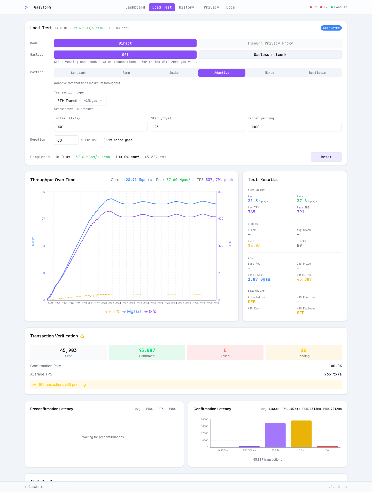

# Demo: the whole stack, and what it costs

One command brings up PostgreSQL, Redis, a Besu node with the approval plugin, and the **real OPS
server** — its own RBAC over its own database, its own signing, its own delivery — then walks four
steps. Nothing about authorization is stubbed: the fixtures are the test identities and wallets, the
development login, and the script standing in for a consensus client and an identity provider.

```sh
cd <repo>
export JAVA_HOME=$PWD/.tmp/jdk25/jdk-25.0.4.1+1/Contents/Home
go build -tags mockauth -o .tmp/ops-server ./cmd/server
(cd poc/besu-signed-approvals && gradle --no-daemon build)

python3 poc/besu-signed-approvals/demo.py            # the four steps, ~2 min
python3 poc/besu-signed-approvals/demo.py --pause    # stop before each step, for a live audience
python3 poc/besu-signed-approvals/demo.py --linea    # with Lineth's transaction-pool plugin loaded too
python3 poc/besu-signed-approvals/demo.py bench      # the numbers below, ~6 min
```

Requirements: Docker (PostgreSQL 15 and Redis 7 containers, removed on exit), JDK 25, Go, Python 3,
Foundry `cast`, solc 0.8.35, and the Besu 26.8.1 distribution under `.tmp/besu-dist/`. Everything is
created fresh per run and torn down afterwards; the OPS log, the node log and `evidence/demo.json`
are kept.

## What the four steps show

| Step | What happens | What it proves |
|---|---|---|
| 1 | Alice calls Bank A's router → relay → vault through OPS | The ordinary path: OPS applies its database policy, signs an approval, delivers it, and Besu commits the transaction. Vault A = 7 |
| 2 | Alice tries to reach Bank B's vault | OPS refuses from the real organization boundary in its database (`transaction denied: cross-org access not permitted`) — nothing reaches the node |
| 3 | Alice's approved call is overtaken by a higher-fee transaction that redirects the relay to Bank B | The producer excludes her transaction: no receipt, and her nonce, her balance and every application slot are unchanged. The hash her client received meant admission, not execution |
| 4 | Alice deploys a contract | Creation is bound by the strict fingerprint, the deployment is included, and OPS registers the new contract to her organization |

Step 3 is the point of the whole design: the approval describes an execution, and an execution that
no longer matches it does not get committed — not "fails with a receipt", but never enters the block.

## Cost

`demo.py bench`: 128 transactions per block from 16 concurrent clients, four samples per
configuration (the first discarded as warm-up), the same load with and without the gate, medians.
Apple M2 Max, everything — OPS, PostgreSQL, Redis, Besu and the load — on one laptop.
Raw data in [evidence/benchmark.json](evidence/benchmark.json).

| | OPS submissions/s | OPS request median | Gate work per transaction |
|---|---:|---:|---:|
| Without the gate | 775 | 17.5 ms | — |
| With the gate | 657 | 21.1 ms | 22 µs |

- **Submission** is end-to-end through the OPS HTTP API — RBAC, database, forwarding, and with the
  gate on also the `ops_prepareApproval` round trip, the Ed25519 signature and the delivery queue.
  The ~3.5 ms it adds to a request is what that preflight costs; the ~15 % difference in rate is
  what 16 clients get out of this laptop, not a capacity limit of the design.
- **Gate work** is the plugin's own pre- plus post-processing per transaction, timed inside the
  selector: the approval lookup, the fingerprint of the observed execution, and the comparison. It
  settles at 12–22 µs once the JIT is warm, and excludes the execution itself and the EVM tracing
  Besu does while building the candidate.
- The harness's block wall-clock is recorded too, but it contains a fixed wait and Besu's repeated
  candidate rebuilds, so it is **not** a producer benchmark. A proper one needs a load generator at
  the node's block cadence — the Reth PoC's Gasstorm runs are the model, and that work has not been
  done here.

Single-client numbers, for comparison: one connection submitting serially gets ~90/s simply because
each round trip is ~11 ms. That is a latency measurement wearing a throughput costume; it is the
concurrent figures above that say anything about the stack.

## Sustained load: Gasstorm Adaptive, the real ceiling

This is the same test the Reth PoC runs, in Gasstorm's own dashboard: **Through Privacy Proxy →
Adaptive → ETH Transfer**, ten wallets, 200 M block gas limit, one-second blocks. Adaptive raises the
rate until the pool backs up, so the peak is measured rather than requested. A browser drives the real
UI; the screenshots below are that browser's, and every confirmation is re-checked against receipts on
chain afterwards.

```sh
# one interactive session to watch yourself
python3 poc/besu-signed-approvals/gasstorm_ui.py            # then open http://127.0.0.1:18000/load-test/
python3 poc/besu-signed-approvals/gasstorm_ui.py --without-gate
python3 poc/besu-signed-approvals/gasstorm_ui.py --direct   # neither OPS nor the gate in the path

# or the scripted A/B that produced the screenshots (needs Playwright; see the script header)
OPS_PLAYWRIGHT_ROOT=... OPS_UI_DURATION=60 ./poc/besu-signed-approvals/run_ui_case.sh gate-on
OPS_PLAYWRIGHT_ROOT=... OPS_UI_DURATION=60 ./poc/besu-signed-approvals/run_ui_case.sh gate-off --without-gate
OPS_PLAYWRIGHT_ROOT=... OPS_UI_DURATION=60 ./poc/besu-signed-approvals/run_ui_case.sh direct --direct
```

Three configurations, because "what does the gate cost" is only half the question — the other half is
how much of the ceiling belongs to Besu itself. **Direct** is Gasstorm's own mode: the generator signs
and submits straight to Besu's RPC, with OPS and the plugin out of the picture entirely.

| 60 s Adaptive, ETH transfer | Average TPS | Peak TPS | Sent | Confirmed | Failed | Successful receipts | Blocks |
|---|---:|---:|---:|---:|---:|---:|---:|
| **Direct to Besu** (no OPS, no gate) | **765** | 791 | 45 903 | 45 887 (100.0 %) | 0 | 45 887 | 59 |
| Through OPS, gate off | 727 | 806 | 43 669 | 43 622 (99.9 %) | 0 | 43 622 | 60 |
| Through OPS, gate **on** | 671 | 773 | 40 277 | 40 198 (99.8 %) | 0 | 40 198 | 59 |



*Direct: 765 tx/s average, 45,887 confirmed, 0 failed — and blocks only 15.9 % full. The gate-on and
gate-off runs are in [browser-gate-on/eth-transfer.png](evidence/gasstorm/browser-gate-on/eth-transfer.png)
and [browser-gate-off/eth-transfer.png](evidence/gasstorm/browser-gate-off/eth-transfer.png).*

**The ceiling on this machine is Besu's, not the gate's.** Taking OPS and the plugin out of the path
entirely buys ~13 % — 765 tx/s instead of 671 — of which OPS's own authorization path is ~5 % and the
approval gate ~7 %. At that ceiling Besu's blocks are **15.9 % full** (1.87 Ggas of a 200 M-per-block
limit over 59 blocks), so what runs out first is Besu's per-transaction RPC and pool handling, not
block space.

Compare the metrics by **average**, not peak: two identical Direct runs peaked at 791 and 905 tx/s
while their averages sat at 765 and 774 (the repeat is in
[evidence/gasstorm/browser-direct/repeat-run/](evidence/gasstorm/browser-direct/repeat-run/)).
Adaptive's peak is a single sample taken while the rate is still climbing, so it swings by over 10 %
between runs of the same configuration — it is the number the dashboard shows, not the number to
draw conclusions from.

Nothing failed in any run; the few dozen still pending are submissions that had not reached a block
when the window closed. Every displayed confirmation was verified against a receipt afterwards —
45,887 receipts in the Direct run, all successful, no duplicates in the generator's log.

Caveats worth stating in the meeting: the generator, OPS, PostgreSQL, Redis and Besu all share one
laptop, so these are the ceilings of *this machine*, not of the design. Confirmation latency is 1.0 s
median in all three (a one-second block cadence sets the floor), p99 6.5–7.0 s.

Raw evidence per run: the dashboard screenshot, the peak screenshot, the generator's own history
record, every status sample, the WebSocket frames, and the gzipped receipt list, under
`evidence/gasstorm/browser-direct/`, `browser-gate-on/` and `browser-gate-off/`.


### Does the approval ever lose the race to its transaction?

The transaction and its approval travel on different paths, and a transaction the producer sees
before its approval waits for the next candidate build (~500 ms on Besu). `gasstorm.py` now records
OPS's own delivery marks (`OPS_APPROVAL_HOPS_FILE`, reduced by `analyze_hops.py`) and, from the
producer's decision log, how many approved transactions were first evaluated before their approval
arrived. Two layouts, gate on, 20 s per rate:

| Layout | Rate | Approvals delivered | enqueue → written p50 / p99 | Allowed after ≥1 wait | Dropped |
|---|---:|---:|---:|---:|---:|
| OPS forwards to the producer | 300 | 6 003 | 62 µs / 1.17 ms | **0** | 0 |
| | 500 | 10 011 | (same sample) | **0** | 0 |
| OPS forwards to a **follower RPC node**, gossip to the producer (`--topology follower`) | 300 | 6 002 ¹ | 64 µs / 0.71 ms | **0** | 0 |
| | 500 | 10 011 | | **0** | 0 |

¹ 6,011 submitted; the generator discarded 9. The OPS log shows why: at 19:59:34.874 a burst of
`context canceled` hit unrelated operations in the same millisecond — preflight `POST`s, address
linking, a compliance-config read — i.e. the *client* cancelled its requests during a brief OPS
latency spike (requests just before took ~80 ms instead of ~12). OPS answered 403 and forwarded
nothing: fail-closed, and not a delivery race. The spike itself is an OPS latency question, not an
approvals one.

The second layout is the deployment's: one Besu sequencer with the plugin, ordinary RPC nodes as
the submission channel, approvals delivered to the sequencer directly. `topology_probe.py` measured
gossip from follower to producer pool at ~80 ms, against a 62 µs approval delivery — the approval's
lead only grows. Delivery is not a latency cost on either layout; what can still cost a candidate
build or the 5 s timeout is a *failed* delivery, which is why the production plan treats
acknowledgements and redelivery as the transport requirement rather than wire speed.

```sh
python3 poc/besu-signed-approvals/gasstorm.py --rates 300,500 --duration 20 --only-gate                      # direct
python3 poc/besu-signed-approvals/gasstorm.py --rates 300,500 --duration 20 --only-gate --topology follower  # via RPC node
python3 poc/besu-signed-approvals/analyze_hops.py evidence/gasstorm/gate-on-hops.json
```

### Constant-rate runs, headless

`gasstorm.py` drives the same generator without the dashboard, at fixed rates, and counts receipts
itself — useful in CI or over SSH:

```sh
python3 poc/besu-signed-approvals/gasstorm.py --rates 100,300,500 --duration 20
```

| Requested | Gate | Submitted | Successful receipts | No receipt | Reverted | Gate work/tx |
|---:|---|---:|---:|---:|---:|---:|
| 100 | off | 2 002 | 2 000 | 2 | 0 | — |
| 100 | **on** | 2 002 | 2 001 | 1 | 0 | 14.2 µs |
| 300 | off | 6 004 | 5 964 | 40 | 0 | — |
| 300 | **on** | 6 003 | 6 001 | 2 | 0 | 8.1 µs |
| 500 | off | 10 012 | 10 012 | 0 | 0 | — |
| 500 | **on** | 10 011 | 9 968 | 43 | 0 | 7.0 µs |

At these fixed rates the two configurations are indistinguishable; the difference only appears when
Adaptive pushes past them. Raw data: [evidence/gasstorm/summary.json](evidence/gasstorm/summary.json).
