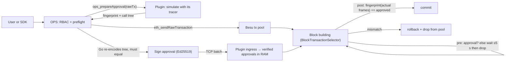

# OPS signed approvals on Besu 26.8.1: a standalone plugin, no Besu patch

Branch `poc/ops-besu-signed-approvals`. Companion to the Reth PoC (`poc/ops-reth-signed-approvals`)
and the [Besu/Lineth research](../../docs/research/dsl-policy-and-node-enforcement/ops-besu-integration-2026-09-14/RESEARCH.md).
Plan and decisions: [PLAN.md](PLAN.md).

**Result: the signed-approval gate runs as one plugin JAR on unmodified Besu 26.8.1 — the version
Lineth pins — and passed all 17 integration scenarios on a real node, including the same-block target
change, caught inner failures, delegatecall, forged fingerprints, a call that turns into a CREATE after
approval, restart, resubmission after a drop, fail-closed start-up, and running beside Lineth's own
sequencer plugins (pool validator, and the transaction selector with its ZK tracer).**
The OPS delivery path (`internal/nodeapproval` signer, batches, TCP framing) is byte-for-byte unchanged;
OPS gains a Besu preflight mode.

## How it works



- **Gate** — `ApprovalSelector` (a `PluginTransactionSelector`). Pre-processing: no verified approval →
  `invalidTransient` while `now − pool admission < wait`, then `invalid` (pool removal).
  Post-processing: the calls-V3 fingerprint of the frames actually executed must equal the approved one;
  otherwise `invalid`. Besu executes every candidate on a child `WorldUpdater` and commits only on
  `SELECTED`, so an excluded transaction leaves no nonce, fee or storage change — the veto-before-commit
  the Reth PoC had to build inside the EVM wrapper is native here.
- **Facts** — `ApprovalTracer` (a `BlockAwareOperationTracer`) records each frame at
  `traceContextEnter/Exit`: kind (parent opcode), caller, code address, storage address, code hash,
  value, calldata, failed; CREATE/CREATE2/SELFDESTRUCT are flagged by opcode at `tracePreExecution`
  (EIP-6780 makes `selfDestructs` unreliable). `CallsFingerprint` encodes the records exactly as
  `internal/nodeapproval/call_fingerprint.go` and the Reth module's `call_hash.rs` (domain
  `OPS_CALLS_V3`); the Go golden vector passes in Java.
- **Preflight** — `ops_prepareApproval(rawTx)` simulates the exact signed bytes through
  `TransactionSimulationService`, on the head state in the pending block's header context, with the
  same tracer, and returns the fingerprint plus a geth-shaped call tree. OPS
  (`internal/nodeapproval/besu.go`, `OPS_APPROVAL_NODE=besu`) checks that the root frame is the signed
  envelope, runs its existing `normalizeCall` + encoder over the tree and **refuses to sign unless its
  own hash equals the plugin's** — every preflight is a cross-implementation check, and RBAC trace
  validation keeps using the tree it always used.
- **Ingress** — `ApprovalListener`: same 4-byte-length frames and `OPS_APPROVAL_BATCH_V1` batches as
  the Reth module, JDK Ed25519 verification, ≤32 connections, 16 KiB frames; anything that does not
  decode or verify is logged and ignored; a frame must arrive within 5 s of its first byte. Approvals live
  only in memory (capacity 100 000 — when full, approvals whose transaction is not in the pool are given
  up oldest-first before a new one is refused; orphan TTL 5 min; released on canonical inclusion).
- **Fail-closed deployment** — enabled by name in `--plugins`; a missing JAR or missing option stops
  Besu at start-up (scenario 12).

## What passed (Besu 26.8.1, JDK 25, Engine-API-driven single producer)

| # | Scenario | Observed |
|---|---|---|
| 1 | Approval delivered, then `run(7)` via router → relay → vault A | Included, receipt status 1, vault A = 7; `allow` decision logged |
| 1b | Parity: Go encoder over Besu's own `debug_traceCall callTracer` + `eth_getCode` vs the plugin's fingerprint | Equal |
| 2 | Transaction first, approval 1 block later | Waits (`wait` decision, stays in pool, not in the first block); included in the next block |
| 3 | No approval, wait 2 s | Not selected before the deadline; `drop` after it; removed from the pool; nonce, balance and vault unchanged |
| 4 | `run(7)` approved with relay → A; higher-fee `setTarget(B)` lands first in the same block | `setTarget` included; `run` **denied** (`OPS_APPROVAL_MISMATCH`), removed from pool; Alice's nonce/balance and both vaults unchanged |
| 5 | Same as 4 with `runCatch` (application catches the inner failure) | Denied; nothing written |
| 6 | `runDelegate(vaultA, 3)` | Plugin tree shows `DELEGATECALL` from router to vault A; included; writes land in the router's storage, vault untouched |
| 7 | Correctly signed approval with a forged fingerprint | Denied and dropped; nonce unchanged |
| 8 | Flipped signature byte; approval for chain id 1; batch with duplicates; re-delivery | Ignored / ignored / harmless; transaction included once the real approval arrives |
| 9 | Eight `tick()` calls from one sender, all approved against one pre-state | All eight included in one block, counter = 8 (calls V3 tolerates storage change) |
| 10 | Contract creation | `ops_prepareApproval` refuses (`unsupported execution: contract creation`); unapproved tx dropped by the producer |
| 11 | Approve, restart node, submit | Dropped after the wait (approvals are RAM only); new preflight + delivery → included |
| 12 | `--plugins=OpsApprovalPlugin` without the JAR; plugin without options | Besu refuses to start in both cases (`requested plugins were not found`, `Halting Besu: OPS approval plugin failed to start`) |
| 13 | Runtime CREATE inside a call (`LifeFactory.create`); `Destructible.destroy` (SELFDESTRUCT) | Both refused at preflight (`contract creation`, `selfdestruct`); the unapproved SELFDESTRUCT tx is dropped, balance untouched |
| 14 | `maybeCreate()` approved while its branch is a plain increment; `setExtra(true)` lands first in the same block | Denied by the producer (`OPS_APPROVAL_UNSUPPORTED: contract creation`), excluded |
| 15 | Same signed `run(7)` resubmitted after the mismatch drop of scenario 4, with a fresh preflight on the new state | Included (vault B = 7): a drop is not a blacklist |
| 16 | `identity()` (STATICCALL to precompile 0x04) and a plain 1-wei transfer to an EOA | Both approved and included |
| 17 | **Beside Lineth's own plugins** (JARs from `linea-besu-package` v2.2.0): (a) `LineaTransactionPoolValidatorPlugin`; (b) `LineaTransactionSelectorPlugin` with its ZK line-counting tracer, on an Osaka fixture chain; (c) the same selector on the Shanghai chain | (a) gate unaffected: approved tx included, unapproved dropped; (b) both selectors and both tracers run in one node — approved tx included (`ZkTracer` in the log), unapproved still dropped by our gate; (c) the plugin loads and starts, then Lineth's tracer aborts block building with `Fork no more supported by the tracer: SHANGHAI` |

Evidence: [tests.json](evidence/tests.json), per-scenario node logs (`evidence/*.log`, decision lines
`OPS_APPROVAL_DECISION allow|wait|drop|deny`), RPC transcripts (`evidence/*-rpc.json`), genesis and
compiled fixtures. Unit tests: 17 Java (`gradle test`: Go golden fingerprint, Go-signed batches over the
wire, slow-loris frame deadline, store capacity, selector fail-closed paths), 5 new Go
(`go test ./internal/nodeapproval/`). The frame → record mapping in `ApprovalTracer` is exercised by
the integration scenarios and the parity check only, not by unit tests. A critic pass against the
code preceded the final run; its blocker (EIP-6780 SELFDESTRUCT invisible to `traceEndTransaction`)
is fixed by the opcode flag.

## What is deliberately not here

- **Lifecycle transactions** (CREATE/CREATE2/SELFDESTRUCT) are refused at preflight and rejected by the
  producer. The Reth PoC's strict-V2 fallback needs opcode-level tracing and prestate logs Besu's
  `callTracer` does not provide; porting it is a separate decision (PLAN.md §Decisions).
- **Producer-only.** Import and historical validation do not consult approvals; a block from another
  producer is not rejected. Same limit as the Reth PoC; a consensus rule needs a Besu change, not a plugin.
- **Timeout eviction happens at the next block-building round**, not on an independent timer — Besu
  exposes no plugin API to remove a pool transaction. Unselectable in the meantime.
- No producer-time benchmark yet; `TracerAggregator` cost is per opcode and must be measured on the
  target workload.
- **Single-producer assumptions**: approvals are released on `HEAD_ADVANCED`/`CHAIN_REORG`; a reorg that
  returns transactions to the pool leaves them waiting for a new approval, which OPS does not re-send.
  Every producer must run the plugin; a plugin that calls `BlockTransactionSelectionService.commit()`
  itself (bundle-style) must be checked before coexistence.
- **Approvals are final once issued** (until inclusion or TTL); there is no revocation path, as in the
  Reth PoC.
- **Besu-vs-geth frame deltas** (do not affect the gate, only which facts a policy can see): Besu creates
  no frame for a CALL with insufficient balance or at depth 1024, nor for a CREATE that fails before
  its frame exists; EIP-7702-delegated code hashes differ from `prestateTracer`'s designator. The
  plugin-served preflight sees exactly what the producer sees, so the two sides agree by construction.
- **Capacity pressure is an OPS concern**: any authorised client can fill the store with orphaned
  approvals for the TTL; the store gives up unpooled approvals first, but rate-limiting belongs in OPS.
- **Untested here**: CALLCODE, out-of-gas inner frames, >128 frames / 1 MiB inputs (unit-tested only),
  approval replacement mid-evaluation, IPv6 listen addresses. The coexistence run uses Lineth's
  *published* plugin JARs on our fixture chain, not their full sequencer configuration (bundles,
  forced transactions, profitability tuning, extra-data pricing) or a Linea network.
- **Harness timing**: after the selector log shows the candidate, the harness waits 0.8–1.2 s before
  the single `engine_getPayload`; on a slow machine that margin is the one flaky spot.
- **`debug_traceCall` + `prestateTracer`** returned "Internal error" on this Besu build for the parity
  check; `eth_getCode` was used instead. OPS's Reth-mode preflight (`muxTracer`, `withLog`) does not work
  against Besu at all — hence the plugin-served preflight.
- Plain TCP inside one perimeter, plugin JAR without a Besu plugin catalog (a start-up WARN).

## Reproduce

Requirements: JDK 25 (Besu 26.x needs it; a Temurin tarball under `.tmp/jdk25/` is enough), Gradle 9,
Go from `go.mod`, Python 3, Foundry `cast`, solc 0.8.35, the Besu 26.8.1 release tarball unpacked at
`.tmp/besu-dist/besu-26.8.1`. No Docker. From the worktree root:

```sh
export JAVA_HOME=$PWD/.tmp/jdk25/jdk-25.0.4.1+1/Contents/Home
(cd poc/besu-signed-approvals && gradle --no-daemon build)      # unit tests + JAR
go test ./internal/nodeapproval/
python3 poc/besu-signed-approvals/run.py                         # all 17 scenarios (20 checks), ~8 min
python3 poc/besu-signed-approvals/run.py same_block_target_change
```

The Lineth coexistence scenario additionally needs the `linea-besu-package` v2.2.0 release unpacked
under `.tmp/linea-pkg/` and its `linea-sequencer`, `linea-tracer`, `arithmetization` and
`sequencer-interfaces` JARs (plus their dependency JARs) copied into the Besu distribution's
`plugins/`; it skips itself when they are absent.

`run.py` copies the JAR into `.tmp/besu-dist/besu-26.8.1/plugins/`, writes the genesis to `evidence/`,
starts an isolated loopback-only Besu per scenario (`.tmp/besu-approval-runs/`), and plays the consensus
client over the Engine API. Plugin options:

```
--plugins=OpsApprovalPlugin
--plugin-ops-approval-listen=127.0.0.1:PORT     --plugin-ops-approval-public-key=HEX32
--plugin-ops-approval-chain-id=31337            --plugin-ops-approval-wait-ms=5000
--plugin-ops-approval-capacity=100000           --plugin-ops-approval-max-connections=32
--plugin-ops-approval-orphan-ttl-ms=300000
```

OPS: `OPS_APPROVAL_NODE=besu`, `OPS_APPROVAL_TARGET=host:port` (the plugin's listen address),
`OPS_APPROVAL_SEED_FILE` as before; the node's `--rpc-http-api` must include `OPS`.

Code map: [gate](src/main/java/ops/approvals/ApprovalSelector.java) ·
[tracer](src/main/java/ops/approvals/ApprovalTracer.java) ·
[encoder](src/main/java/ops/approvals/CallsFingerprint.java) ·
[ingress](src/main/java/ops/approvals/ApprovalListener.java) ·
[preflight RPC](src/main/java/ops/approvals/PrepareApprovalRpc.java) ·
[plugin wiring](src/main/java/ops/approvals/OpsApprovalPlugin.java) ·
[OPS Besu mode](../../internal/nodeapproval/besu.go) · [harness](harness.py) · [scenarios](run.py).
