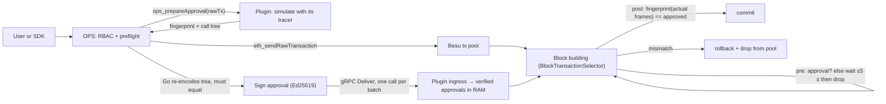

# OPS signed approvals on Besu 26.8.1: a standalone plugin, no Besu patch

Branch `poc/ops-besu-signed-approvals`. Companion to the Reth PoC (`poc/ops-reth-signed-approvals`)
and the [Besu/Lineth research](../../docs/research/dsl-policy-and-node-enforcement/ops-besu-integration-2026-09-14/RESEARCH.md).
Plan and decisions: [PLAN.md](PLAN.md).

[5,000/sec performance and retention measurements](../approval-performance/README.md):
four verification workers kept approval delivery current on the measured host; full-stack
5,000 committed TPS remains unproven. Includes memory sizing and restart under fresh traffic.

**Result: the signed-approval gate runs as one plugin JAR on unmodified Besu 26.8.1 — the version
Lineth pins — and passed the full integration suite (25 checks) on a real node, including the same-block target
change, caught inner failures, delegatecall, forged fingerprints, a call that turns into a CREATE after
approval, contract deployment and self-destruction, restart, resubmission after a drop, fail-closed
start-up, every refusal of the delivery contract with its status code, an approval that expires
before its transaction is built, a restart healed automatically by the live OPS sender on the new boot id, and running beside
Lineth's own sequencer plugins (pool validator, and the transaction selector with its ZK tracer).**
Approvals arrive over gRPC: the plugin serves `ops.approvals.v1.ApprovalDelivery` exactly as the
[wire contract](../../docs/implementation/approvals-wire-contract.md) specifies — one `Deliver` call per
signed batch, whose status is the confirmation, and `Status` with the boot id OPS resends on. OPS gains a
Besu preflight mode.

**[DEMO.md](DEMO.md) — one command brings up the real OPS server, PostgreSQL, Redis and Besu and walks
four steps (allowed call, cross-org refusal, same-block divergence veto, contract deployment), plus
the cost measurement.**

## How it works



- **Gate** — `ApprovalSelector` (a `PluginTransactionSelector`). Pre-processing: no usable approval
  (none, or expired: now ≥ `expires_at`) → `invalidTransient` while `now − pool admission < wait`, then
  `invalid` (pool removal). Post-processing: the approval must still be usable, and the calls-V3
  fingerprint of the frames actually executed must equal the approved one; otherwise `invalid`. Besu executes every candidate on a child `WorldUpdater` and commits only on
  `SELECTED`, so an excluded transaction leaves no nonce, fee or storage change — the veto-before-commit
  the Reth PoC had to build inside the EVM wrapper is native here.
- **Facts** — `ApprovalTracer` (a `BlockAwareOperationTracer`) records each frame at
  `traceContextEnter/Exit`: kind (parent opcode), caller, code address, storage address, code hash,
  value, calldata, failed; CREATE/CREATE2/SELFDESTRUCT are flagged by opcode at `tracePreExecution`
  (EIP-6780 makes `selfDestructs` unreliable). `CallsFingerprint` encodes the records exactly as
  `internal/nodeapproval/call_fingerprint.go` and the Reth module's `call_hash.rs` (domain
  `OPS_CALLS_V3`); the Go golden vector passes in Java.
- **State, for lifecycle transactions** — the same tracer records what the execution read and wrote
  (`StateSnapshot`: accounts at first touch, slots at their first `SLOAD`/`SSTORE`, the self-destruct
  beneficiary off the stack, per-frame logs and return data) and emits it in geth's `prestateTracer`
  shape. `StrictFingerprint` then reproduces `internal/nodeapproval.Fingerprint` — same projection,
  same canonical JSON, same `OPS_EXECUTION_V2` domain, verified against its Go golden vector. This is
  what lets **contract deployment work**: an execution that creates or destroys a contract is approved
  in strict mode, which binds the resulting state, instead of being refused.
  "Before" values are read at first touch and "after" values when the root frame exits — before Besu
  refunds gas, pays the fee recipient, settles self-destructs or clears emptied accounts — so fees
  never enter the fingerprint and the preflight block's base fee cannot invalidate an approval; the
  settlement and clearing rules are then applied by the snapshot itself.
- **Mode** — the *execution* decides: calls V3 unless it creates or destroys a contract, in which case
  strict V2. OPS derives the same mode from the returned call tree and refuses if the plugin's label
  disagrees, so a plugin cannot downgrade a deployment to the weaker binding.
- **Preflight** — `ops_prepareApproval(rawTx)` simulates the exact signed bytes through
  `TransactionSimulationService`, on the head state in the pending block's header context, with the
  same tracer, and returns the fingerprint plus a geth-shaped call tree. OPS
  (`internal/nodeapproval/besu.go`, `OPS_APPROVAL_NODE=besu`) checks that the root frame is the signed
  envelope (for a deployment: a `CREATE` of the address the signed nonce determines), runs its
  existing `normalizeCall` + encoder over the tree — `Fingerprint` for strict, `CallFingerprint` for
  calls — and **refuses to sign unless its own hash equals the plugin's** — every preflight is a cross-implementation check, and RBAC trace
  validation keeps using the tree it always used.
- **Ingress** — `ApprovalServer` serves the gRPC contract on the grpc-java 1.79.0 and Netty 4.2.17
  that Besu 26.8.1 ships, and hands each batch to `ApprovalIngress`, which checks it in the contract's
  order and answers with the first failing check's status: undecodable → `INVALID_ARGUMENT`, untrusted
  key id → `PERMISSION_DENIED`, signature (JDK Ed25519) → `UNAUTHENTICATED`, another chain →
  `INVALID_ARGUMENT`, TTL above the node's maximum → `INVALID_ARGUMENT`, issued more than 5 s ahead or
  already expired → `FAILED_PRECONDITION`, no room → `UNAVAILABLE` with the trailer
  `ops-approval-reason: store-full`. `OK` carries the boot id and the approval count. A batch is all or
  nothing. Requests are capped at 64 KiB (gRPC itself answers `RESOURCE_EXHAUSTED` above that); an idle
  connection may ping every 10 s; unlisted sources and connections beyond the cap are closed at
  accept, before HTTP/2 sees a byte. The plugin JAR (2.1 MB) bundles only what Besu lacks — grpc-stub,
  grpc-protobuf and protobuf-java — relocated under `ops.approvals.shaded`, so no class can clash with
  Besu's or another plugin's; the build refuses a JAR with a class outside `ops/approvals/`.
- **Store** — memory only, keyed by transaction hash; per transaction the approval with the greatest
  (`issued_at`, key id, fingerprint) is kept, so a primary and a standby agree. An approval is usable
  while now < `expires_at` and is kept until then or until the block that included its transaction is
  final, whichever comes first — expiry is what bounds the store when finality lags. Under pressure the
  store evicts expired approvals, then those of included transactions, then the oldest orphans by
  `issued_at`; never an approval whose transaction is pooled, never one younger than the wait window
  (measured from `issued_at`). A restart draws a new boot id; until OPS's first `Status` call after
  boot, for at most 60 s, a transaction's wait counts from that call, so transactions re-announced by
  the RPC nodes survive until OPS has resent.
- **Fail-closed deployment** — enabled by name in `--plugins`; a missing JAR or missing option stops
  Besu at start-up (scenario 12).

## What passed (Besu 26.8.1, JDK 25, Engine-API-driven single producer)

| # | Scenario | Observed |
|---|---|---|
| 1 | Approval delivered, then `run(7)` via router → relay → vault A | Included, receipt status 1, vault A = 7; `allow` decision logged |
| 1b | Parity: Go encoder over Besu's own `debug_traceCall callTracer` + `eth_getCode` vs the plugin's fingerprint | Equal |
| 2 | Transaction first, approval 1 block later | Waits (`wait` decision, stays in pool, not in the first block); included in the next block |
| 3 | No approval, wait 2 s | Not selected before the deadline; `drop` after it; removed from the pool; nonce, balance and vault unchanged |
| 4 | `run(7)` approved with relay → A; higher-fee `setTarget(B)` lands first in the same block | `setTarget` included; `run` **denied** (`OPS_APPROVAL_MISMATCH`), removed from pool; Alice's nonce/balance and both vaults unchanged |
| 5 | Same as 4 with `runCatch` (application catches the inner failure) | Denied; nothing written |
| 6 | `runDelegate(vaultA, 3)` | Plugin tree shows `DELEGATECALL` from router to vault A; included; writes land in the router's storage, vault untouched |
| 7 | Correctly signed approval with a forged fingerprint | Denied and dropped; nonce unchanged |
| 8 | Every refusal of the delivery contract: garbage, untrusted key id, flipped signature byte, another key under a trusted id, chain id 1, a 2 h TTL, issued 60 s ahead, expired, one approval more than the store holds; then a batch with duplicates, and a re-delivery | `INVALID_ARGUMENT`, `PERMISSION_DENIED`, `UNAUTHENTICATED` ×2, `INVALID_ARGUMENT` ×2, `FAILED_PRECONDITION` ×2, `UNAVAILABLE` with `store-full`; nothing stored, the transaction waits; duplicates and re-delivery `OK`, transaction included; Besu's metrics endpoint counts every batch by status |
| 9 | Eight `tick()` calls from one sender, all approved against one pre-state | All eight included in one block, counter = 8 (calls V3 tolerates storage change) |
| 10 | A transaction the plugin cannot describe (an unsupported type, or a lifecycle operation with no observable frame) | Refused at preflight; without an approval the producer drops it after the wait |
| 11 | Approve, stop OPS and restart the node, start a fresh OPS sender, submit | Dropped after the wait (approvals are RAM only); new preflight + delivery → included |
| 12 | `--plugins=OpsApprovalPlugin` without the JAR; plugin without options | Besu refuses to start in both cases (`requested plugins were not found`, `Halting Besu: OPS approval plugin failed to start`) |
| 13a | **Plain contract deployment** | Approved in strict mode, included, receipt names the created address, code persists |
| 13b | Runtime `CREATE` and `CREATE2` inside a call (`LifeFactory`), and `SELFDESTRUCT` (`Destructible.destroy`) | All approved in strict mode and included; the constructor's nested call is bound (vault = 7); the destroyed contract's balance is swept |
| 13c | A second deployment in the same block writes a slot the first one's approval binds | The first is denied (`MISMATCH`), nothing persisted; the positive control (same transaction alone) is included |
| 13d | **The plugin's own state snapshot against the mined block** — every account and slot it reported in `diff.post` is re-read with `eth_getCode` / `eth_getTransactionCount` / `eth_getStorageAt` / `eth_getBalance` | All match (6 facts on the runtime-CREATE transaction); the deployment scenario additionally asserts OPS's `SurvivingCreations`/`FreshCreations` name the created address |
| 14 | `maybeCreate()` approved in calls mode; `setExtra(true)` lands first in the same block and the call now deploys | Denied (`approval mode 3, execution requires 0`): the execution's mode decides, so a calls approval never covers a deployment |
| 15 | Same signed `run(7)` resubmitted after the mismatch drop of scenario 4, with a fresh preflight on the new state | Included (vault B = 7): a drop is not a blacklist |
| 16 | `identity()` (STATICCALL to precompile 0x04) and a plain 1-wei transfer to an EOA | Both approved and included |
| 17 | **Beside Lineth's own plugins** (JARs from `linea-besu-package` v2.2.0): (a) `LineaTransactionPoolValidatorPlugin`; (b) `LineaTransactionSelectorPlugin` with its ZK line-counting tracer, on an Osaka fixture chain; (c) the same selector on the Shanghai chain | (a) gate unaffected: approved tx included, unapproved dropped; (b) both selectors and both tracers run in one node — approved tx included (`ZkTracer` in the log), unapproved still dropped by our gate; (c) the plugin loads and starts, then Lineth's tracer aborts block building with `Fork no more supported by the tracer: SHANGHAI` |
| 18 | **An approval that expires first**: delivered by the real OPS sender with its minimum 10 s TTL, the transaction submitted after it expired; and a second transaction pooled while its approval was valid, its block built after the approval expired | The store evicts the first; that transaction waits, is dropped when its window ends, nothing written; an explicitly expired envelope → `FAILED_PRECONDITION`; with a fresh approval the same signed transaction is included. The second is dropped at selection (`approval=expired` in the decision log), never included |
| 19 | **Automatic restart recovery**: the actual OPS sender confirms and retains an approval, stays alive while the producer restarts on the same address, and an RPC node re-announces the transaction | OPS's own `Status` polling sees the new boot id and redelivers the retained batch; sender metrics show one recovery and two confirmed deliveries, the receipt succeeds and vault A = 7. The harness performs no new preflight, enqueue, `Status` or `Deliver` after restart |

The 2026-09-25 follow-up run passed all **25 integration checks** and all **four real OPS demo
checks**. Compact evidence: [scenario results](evidence/review-followups-2026-09-25/tests.json),
[demo results](evidence/review-followups-2026-09-25/demo.json), and the
[live sender recovery log](evidence/review-followups-2026-09-25/resend-a-sender.log). The earlier
recorded runs remain intact below.

Earlier evidence: [tests.json](evidence/tests.json), per-scenario node logs (`evidence/*.log`, decision lines
`OPS_APPROVAL_DECISION allow|wait|drop|deny`), RPC transcripts (`evidence/*-rpc.json`), genesis and
compiled fixtures. Unit tests: 100 Java (`gradle build`: Go golden fingerprints and Go-signed batches,
canonical JSON, the state snapshot, selector fail-closed paths; the status code of every contract check
and their order, all-or-nothing, the boot id and `Status`; the store's replacement rule, expiry,
eviction order, youth from `issued_at` and room counted before eviction, also as random operation
sequences checked against those invariants; expiry at selection and the wait window after boot;
finality release through empty and expired blocks; and real gRPC round trips on loopback with a
grpc-java client — refusal codes and the `store-full` trailer over the wire, the 64 KiB cap, allowed
sources (also when the guard itself fails), required source configuration, the connection cap,
idle/preface slot reclamation, the port released on close, and keepalive pings with no call in flight), plus a build check that the JAR carries no class outside
`ops/approvals/`; Go tests with OPS (`go test ./internal/nodeapproval/...`). The frame → record mapping in `ApprovalTracer` is exercised by
the integration scenarios and the parity check only, not by unit tests. A critic pass against the
code preceded the final run; its blocker (EIP-6780 SELFDESTRUCT invisible to `traceEndTransaction`)
is fixed by the opcode flag.

## Cost

Gasstorm's Adaptive test through the real dashboard, 60 s of ETH transfers on one M2 Max running
everything: **671 tx/s average with the gate, 727 without it, and 765 submitting straight to Besu**
(40,198 / 43,622 / 45,887 confirmed, zero failures in any run). So the gate costs ~7 % and OPS's
authorization path ~5 %, and **the remaining ceiling is Besu's** — at it, blocks are only 15.9 % full.
Per request, OPS costs 17.5 ms without the gate and 21.1 ms with it; the plugin's own work inside the
block producer is 7–22 µs per transaction. [DEMO.md](DEMO.md) has the screenshots, the constant-rate
table and what each number does and does not cover.

## What is deliberately not here

- **Strict V2 is state-exact, by design.** A deployment (or any lifecycle transaction) is approved
  against the exact state it read and wrote, so a concurrent transaction in the same block that
  touches one of those slots denies it — it must be re-submitted after a fresh preflight. This is the
  same trade-off the Reth PoC makes, and the reason ordinary calls use the looser calls-V3 mode.
- **Producer-only.** Import and historical validation do not consult approvals; a block from another
  producer is not rejected. Same limit as the Reth PoC; a consensus rule needs a Besu change, not a plugin.
- **Timeout eviction happens at the next block-building round**, not on an independent timer — Besu
  exposes no plugin API to remove a pool transaction. Unselectable in the meantime.
- **Throughput, measured with Gasstorm Adaptive on this laptop: 671 tx/s average with the gate, 727
  without it, 765 with OPS out of the path entirely** — 40,198 confirmed transactions in 60 s with the
  gate, nothing failed, every confirmation checked against a receipt. That is the ceiling of one
  machine running the generator, OPS, PostgreSQL, Redis and Besu together, not of the design — and
  most of it is Besu's, not the gate's. Screenshots and per-run evidence in [DEMO.md](DEMO.md).
- **Single-producer assumptions**: approvals are released when the including block is **final**
  (`BlockchainService.getFinalizedBlock()`, walked along parent links), not when it is added, so a
  transaction that returns to the pool after a reorganisation finds its approval still there
  (scenario `reorg_keeps_approvals`). What does *not* return by itself is the transaction: Besu
  26.8.1 re-adds a reorganised block's transactions to its pool unreliably (observed: a sender's
  nonce 1 back and nonce 0 dropped; another run, neither), so the client — or a future OPS
  reconciler — resubmits the same signed bytes, and no new approval is needed. Release on finality
  is bounded by expiry: every block is tracked, empty ones included, so the walk from the
  finalized head never breaks; its approvals go when they expire, its link once no approval can be
  alive (the maximum TTL). A reorganisation after expiry needs a fresh preflight. Every
  producer must run the plugin; a plugin that calls `BlockTransactionSelectionService.commit()`
  itself (bundle-style) must be checked before coexistence.
- **Approvals are final once issued**, until they expire (the signed `expires_at`: OPS's TTL, at most
  the node's `--plugin-ops-approval-max-ttl-ms`) or their block is final; there is no other revocation
  path.
- **Transaction types are a PoC scope limit, not a technical barrier.** `nodeapproval.Prepare` approves
  protected legacy and EIP-1559 only; access-list (2930), blob (4844) and set-code (7702) transactions are
  refused. OPS itself has no such limit — the product's raw-transaction path is type-agnostic and forwards
  every type; this is the approval path alone, and it is opt-in (`OPS_APPROVAL_TARGET`). Access-list and
  blob support is a short change, since neither alters execution semantics. **EIP-7702 is doable but is real
  work**: its authorization list installs code on an EOA outside the call tree, so `CallFingerprint` cannot
  see it and the signed envelope has to carry it — both encoders, plus a decision on what a delegation means
  for contract ownership.
- **Besu-vs-geth frame deltas** (do not affect the gate, only which facts a policy can see): Besu creates
  no frame for a CALL with insufficient balance or at depth 1024, nor for a CREATE that fails before
  its frame exists; EIP-7702-delegated code hashes differ from `prestateTracer`'s designator. The
  plugin-served preflight sees exactly what the producer sees, so the two sides agree by construction.
- **Capacity pressure is an OPS concern**: any authorised client can fill the store with orphaned
  approvals for the TTL; the store gives up expired, then included, then orphaned approvals first and
  then refuses (`UNAVAILABLE`, OPS backs off), but rate-limiting belongs in OPS.
- **Untested here**: a reverted inner frame that emitted logs (the tracer discards a failed frame's
  logs, as geth does, but no scenario exercises it), CALLCODE, out-of-gas inner frames,
  >128 frames / >4096 touched accounts / >16384 touched slots (the snapshot fails closed at those
  caps, unit-tested only),
  approval replacement mid-evaluation, IPv6 listen addresses (`[addr]:port` is parsed, unit-tested
  only). The coexistence run uses Lineth's
  *published* plugin JARs on our fixture chain, not their full sequencer configuration (bundles,
  forced transactions, profitability tuning, extra-data pricing) or a Linea network.
- **Harness timing**: after the selector log shows the candidate, the harness waits 0.8–1.2 s before
  the single `engine_getPayload`; on a slow machine that margin is the one flaky spot.
- **`debug_traceCall` + `prestateTracer`** returned "Internal error" on this Besu build for the parity
  check; `eth_getCode` was used instead. OPS's Reth-mode preflight (`muxTracer`, `withLog`) does not work
  against Besu at all — hence the plugin-served preflight.
- Plaintext gRPC inside one perimeter (TLS is postponed: plan §0.3), plugin JAR without a Besu plugin
  catalog (a start-up WARN).

## Reproduce

Requirements: JDK 25 (Besu 26.x needs it; a Temurin tarball under `.tmp/jdk25/` is enough), Gradle 9,
Go from `go.mod`, Python 3, Foundry `cast`, solc 0.8.35, the Besu 26.8.1 release tarball unpacked at
`.tmp/besu-dist/besu-26.8.1`. No Docker. From the worktree root:

```sh
export JAVA_HOME=$PWD/.tmp/jdk25/jdk-25.0.4.1+1/Contents/Home
(cd poc/besu-signed-approvals && gradle --no-daemon build)      # unit tests + JAR
go test ./internal/nodeapproval/
python3 poc/besu-signed-approvals/run.py                         # full suite (25 checks), ~5 min
python3 poc/besu-signed-approvals/run.py same_block_target_change
python3 poc/besu-signed-approvals/run.py restart_resend_restores_inclusion
```

The Lineth coexistence scenario additionally needs the `linea-besu-package` v2.2.0 release unpacked
under `.tmp/linea-pkg/` and its `linea-sequencer`, `linea-tracer`, `arithmetization` and
`sequencer-interfaces` JARs (plus their dependency JARs) copied into the Besu distribution's
`plugins/`; it skips itself when they are absent.

For an isolated review run, use a private copy of the distribution and a separate evidence directory:

```sh
cp -R .tmp/besu-dist/besu-26.8.1 .tmp/besu-review-private
export OPS_BESU_HOME=$PWD/.tmp/besu-review-private
export OPS_EVIDENCE_DIR=$PWD/.tmp/besu-review-evidence
python3 poc/besu-signed-approvals/run.py restart_resend_restores_inclusion
```

The recovery test keeps one Go sender process alive across the Besu restart. The harness only reads
its metrics and JSON logs after the restart; the service owns reconnection, boot detection and
redelivery. Evidence records both boot ids, exactly one redelivery, two confirmed batches and the
successful receipt. The separate `restart_loses_approvals` scenario stops OPS too and demonstrates
the remaining in-memory retention limitation. Node and sender logs scrub local machine paths.

`run.py` copies the JAR into the Besu distribution's `plugins/` (`.tmp/besu-dist/besu-26.8.1`, or
`OPS_BESU_HOME`), writes the genesis to `evidence/`, starts an isolated loopback-only Besu per scenario
(`.tmp/besu-approval-runs/`), plays the consensus client over the Engine API, and plays OPS through the
Go fixture client (`client/`), which runs `nodeapproval.New` and `Enqueue`: the same preflight, signer,
queue, delivery lanes, retained batches and periodic `Status` calls as OPS. Raw signing and raw gRPC
`Deliver` are reserved for malformed/refused envelopes. Plugin
options (wire contract §7):

```
--plugins=OpsApprovalPlugin
--plugin-ops-approval-listen=HOST:PORT          gRPC delivery service; required
--plugin-ops-approval-public-keys=default=HEX32[,next=HEX32]   trusted OPS keys; required
--plugin-ops-approval-chain-id=31337            required
--plugin-ops-approval-wait-ms=5000              how long a pooled transaction waits for its approval
--plugin-ops-approval-capacity=100000           approvals the store holds
--plugin-ops-approval-max-ttl-ms=3600000        longest expires_at - issued_at accepted; 10 s to 24 h
--plugin-ops-approval-allowed-sources=CIDR[,CIDR]   required; use any explicitly to rely on network rules
--plugin-ops-approval-max-connections=32        open delivery connections
--plugin-ops-approval-max-concurrent-calls=32   calls in flight per connection
--plugin-ops-approval-verify-workers=2         verification workers, 1 to 32
```

The orphan lifetime is gone (expiry replaces it), and so are the raw-TCP frame limits: the gRPC
service caps requests at 64 KiB, advertises the concurrent-call cap in HTTP/2 SETTINGS, requires the
HTTP/2 preface within 5 s, and closes connections with no calls for 30 s. These fixed timeouts are
not CLI options. Keepalive pings are permitted every 10 s with no call in flight (OPS pings every
20 s), but pings do not reset the idle timeout. OPS's own `Status` call every second keeps its lane
active. Every harness producer explicitly allows only `127.0.0.1/32`.

Verification workers are separate from network I/O. The default remains two. If approval
delivery falls behind under sustained load, test a larger pool against the CPU budget of the
producer; more workers can compete with transaction execution. The maximum batch size of 32
does not mean arrivals are actually grouped in batches of 32. Size against the measured batch
rate and confirmation latency, not only approvals accepted into OPS's memory queue.

OPS: `OPS_APPROVAL_NODE=besu`, the plugin's listen address as a delivery target
(`OPS_APPROVAL_TARGETS`, wire contract §7), `OPS_APPROVAL_SEED_FILE` as before; the node's
`--rpc-http-api` must include `OPS`. OPS must deliver over the gRPC contract: a sender still writing
raw TCP frames is cut off at the HTTP/2 preface, so its transactions wait and are dropped — fail
closed, and the reason `demo.py` and `gasstorm.py` need the gRPC-speaking OPS.

**The delivery port is for OPS only — an operator requirement.** The service is plaintext gRPC and
authenticates batches, not peers: the Ed25519 signature means nobody can forge or alter an approval,
but anyone who reaches the port can make the producer verify junk and hold connections up to the
cap. A network rule (security group, firewall or network policy) must let only the OPS instances
reach `--plugin-ops-approval-listen`; that rule is the compensating control for TLS being postponed.
`--plugin-ops-approval-allowed-sources` is required: list the OPS source CIDRs, or explicitly set
`any` when relying on the network rule alone. CIDRs are matched on each connection's remote address
and unmatched connections are refused at accept. The list adds defence in depth to the network rule;
`--plugin-ops-approval-max-connections` and `--plugin-ops-approval-max-concurrent-calls` bound what any
peer that gets through can hold.
Each target address must reach exactly one producer: no load balancer in front of the port, or the
boot id changes on every reconnect.

**Metrics** go through Besu's metrics system under the category `ops_approval`, which Besu does not
enable by default: add it to `--metrics-category`. `ops_approval_batches_total{status}` counts every
delivered batch by its gRPC status; `ops_approval_approvals_stored_total`, `ops_approval_store_size`,
`ops_approval_connections` and `ops_approval_connections_refused_total{reason=source|limit}` cover the
store and the port; `ops_approval_decisions_total{decision=allow|wait|drop|deny,reason}` counts the
gate's decisions, once per candidate build, so one transaction can count several times.

**Keys and rotation.** A batch names the key that signed it, inside the signed bytes, and the
plugin holds a *set* of trusted keys (`--plugin-ops-approval-public-keys id=hex,id=hex`;
`--plugin-ops-approval-public-key` alone means the id `default`). OPS signs under
`OPS_APPROVAL_KEY_ID` (default `default`) with the Ed25519 seed from `OPS_APPROVAL_SEED_FILE` — a
file because that is how a Secrets Manager–mounted secret (CSI) arrives; never from a config file.
To rotate: add the new key to the plugin's set, switch OPS's key id and seed, remove the old id.
No node restart has to coincide with an OPS restart. A batch under an unknown id is refused and
logged with the id.

The `OPS` namespace (`ops_prepareApproval`) only simulates, but it simulates on the block producer and
has no authentication of its own. Expose it on an RPC listener that only OPS can reach — network
policy, or Besu's own RPC authentication (`--rpc-http-authentication-enabled`) — never on a listener
that serves users; the same holds for the delivery port above.

Demo and benchmarks: [demo.py](demo.py), headless load [gasstorm.py](gasstorm.py), the dashboard
session [gasstorm_ui.py](gasstorm_ui.py) + [run_ui_case.sh](run_ui_case.sh) (see [DEMO.md](DEMO.md)).

Code map: [gate](src/main/java/ops/approvals/ApprovalSelector.java) ·
[tracer](src/main/java/ops/approvals/ApprovalTracer.java) ·
[encoder](src/main/java/ops/approvals/CallsFingerprint.java) ·
[ingress checks](src/main/java/ops/approvals/ApprovalIngress.java) ·
[gRPC service](src/main/java/ops/approvals/ApprovalServer.java) ·
[store](src/main/java/ops/approvals/ApprovalStore.java) ·
[preflight RPC](src/main/java/ops/approvals/PrepareApprovalRpc.java) ·
[plugin wiring](src/main/java/ops/approvals/OpsApprovalPlugin.java) ·
[OPS Besu mode](../../internal/nodeapproval/besu.go) · [harness](harness.py) · [scenarios](run.py).
