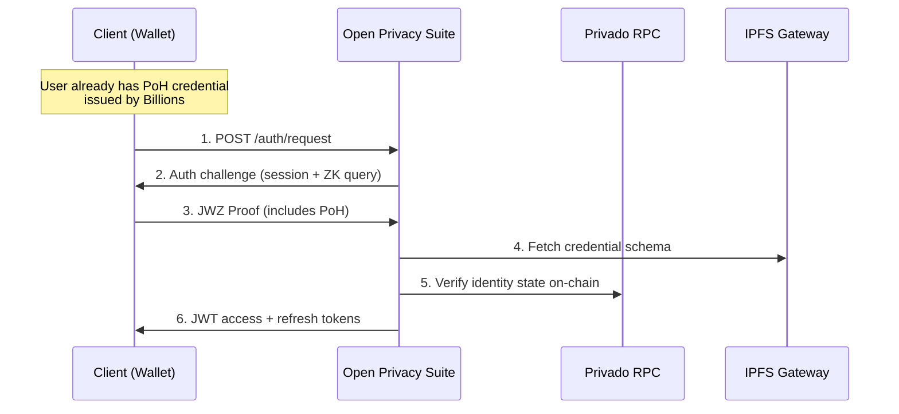

import { Callout } from "@/components/mdx/callout";
import { ApiEndpoint } from "@/components/mdx/api-endpoint";
import { EnvTable } from "@/components/mdx/env-table";
import { Step } from "@/components/mdx/step";
export const metadata = {
  title: "Authentication",
  description:
    "ZK-proof authentication via Privado ID with optional ProofOfHumanity verification and Azure AD SSO.",
};

# Authentication

## Overview

The Open Privacy Suite authenticates users through **Privado ID zero-knowledge proofs** with optional
**ProofOfHumanity (PoH)** verification via Billions. Users prove their identity without revealing
private keys, and can optionally link Ethereum addresses via EIP-191 signatures.

For SSO-based authentication using Microsoft Entra ID, see the [Azure AD / SSO](/docs/azure-ad) guide.

## Architecture



## Auth Flow

<Step number={1} title="Client requests auth challenge">

`POST /auth/request` -- the client initiates authentication by requesting a Privado ID
authorization challenge. The server generates a session ID, creates an authorization request
with a ProofOfHumanity ZK query (if enabled), and returns both to the client.

When `REQUIRE_PROOF_OF_HUMANITY=true` the request includes a ZK credential query. The circuit,
schema URL, credential type, and the predicate applied to `credentialSubject` are all configured
(see [Configuration](#configuration)). An example assembled from defaults plus a credential query
file containing `{"credentialSubject":{"isHuman":{"$eq":1}}}`:

```json
{
  "id": 1,
  "circuitId": "credentialAtomicQueryMTPV2",
  "query": {
    "allowedIssuers": ["did:polygonid:polygon:amoy:..."],
    "credentialSubject": { "isHuman": { "$eq": 1 } },
    "context": "https://raw.githubusercontent.com/0xPolygonID/tutorial-examples/main/credential-schema/schemas-examples/proof-of-humanity/proof-of-humanity.jsonld",
    "type": "ProofOfHumanity"
  }
}
```

`allowedIssuers` is set to `[BILLIONS_ISSUER_DID]`. `context` and `type` come from
`BILLIONS_CREDENTIAL_SCHEMA_URL` and `BILLIONS_CREDENTIAL_TYPE`. `credentialSubject` is taken
verbatim from the JSON file pointed to by `BILLIONS_CREDENTIAL_QUERY_FILE`.

</Step>

<Step number={2} title="Wallet generates ZK proof">

The client's Privado wallet creates a **JWZ (JSON Web Zero-knowledge)** token that:

- Proves DID ownership without revealing private keys
- Proves possession of a ProofOfHumanity credential (`isHuman=1`)
- Is cryptographically bound to the authorization request
- Cannot be replayed to other verifiers

</Step>

<Step number={3} title="Client submits proof">

The proof is submitted to one of two endpoints:

<ApiEndpoint method="POST" path="/auth/callback?session={session_id}" description="Wallet callback -- the standard flow" />
<ApiEndpoint method="POST" path="/auth/verify" description="Manual submission (development only)" />

The server retrieves the session, extracts and verifies the JWZ token against the original
auth request, checks the PoH credential (if required), and extracts the user DID.

</Step>

<Step number={4} title="JWT tokens issued (or rejection)">

On success the server returns an access/refresh token pair:

```json
{
  "access_token": "eyJhbGc...",
  "refresh_token": "eyJhbGc...",
  "token_type": "Bearer",
  "expires_in": 300
}
```

If the user lacks a valid ProofOfHumanity credential the server responds with **403 Forbidden**:

```json
{
  "error": "humanity_verification_required",
  "message": "Please complete ProofOfHumanity verification at Billions",
  "verify_url": "https://app.billions.network"
}
```

</Step>

---

## ETH Address Linking

Users can link Ethereum addresses to their DID. There are two link types:

- **User-initiated link** (`link_type: user`) — the user proves ownership by signing an EIP-191 challenge. This is the explicit, user-controlled flow.
- **System-inferred link** (`link_type: system`) — when a user submits a signed transaction (`eth_sendRawTransaction`) and the proxy forwards it successfully, the sender address (cryptographically recovered from the transaction signature) is automatically linked to the user's DID. This enables response filters to recognise transactions without requiring a separate linking step.

User-initiated links take precedence over system-inferred links when both exist for the same address.

### User-Initiated Linking

<Step number={1} title="Request challenge">

<ApiEndpoint method="POST" path="/eth/link/challenge" description="Request a signing challenge (JWT required)" />

Returns a nonce and a human-readable message for the user to sign.

```json
{
  "nonce": "a1b2c3d4e5f6...",
  "message": "Link Ethereum address to DID\n\nI authorize linking this Ethereum address to my decentralized identity.\n\nDID: did:privado:...\nNonce: a1b2c3d4e5f6..."
}
```

</Step>

<Step number={2} title="Sign the message">

The user signs the message with their Ethereum wallet (MetaMask, etc.) using `personal_sign`.

</Step>

<Step number={3} title="Submit signature">

<ApiEndpoint method="POST" path="/eth/link/verify" description="Submit signed challenge (JWT required)" />

```json
{
  "nonce": "a1b2c3d4e5f6...",
  "address": "0x742d35Cc6634C0532925a3b844Bc9e7595f...",
  "signature": "0x..."
}
```

</Step>

<Step number={4} title="View or unlink addresses">

<ApiEndpoint method="GET" path="/eth/addresses" description="List linked addresses (JWT required)" />
<ApiEndpoint method="DELETE" path="/eth/addresses/:address" description="Unlink an address (JWT required)" />

</Step>

### Address Collision Detection

A single ETH address can be linked by more than one DID — for example, a shared deployer wallet used by a team, or a key-compromise event. When this occurs, the system:

1. **Allows the link** — shared keys are a legitimate pattern (multi-sig, shared deployer, team wallet).
2. **Emits a SIEM event** with elevated severity (`eth_address_linked_collision`) so administrators can review.
3. **Surfaces collisions in the admin dashboard** — administrators can view all addresses linked to multiple DIDs at `GET /api/v1/admin/eth-addresses/collisions`.

If a collision is judged to be a key-compromise event rather than intentional sharing, the administrator can revoke the unwanted link.

---

## Configuration

<EnvTable vars={[
  { name: "REQUIRE_PROOF_OF_HUMANITY", default: "false", description: "Opt-in flag. When true, login requires a valid credential (Path B). When false, login only proves DID ownership (Path A). Enabling this without populating the other Path B vars causes the server to refuse to start." },
  { name: "BILLIONS_ISSUER_DID", default: "(none)", description: "Issuer DID whose credentials are accepted (required when PoH enabled)" },
  { name: "PRIVADO_STATE_CONTRACT", default: "0x3C9acB2205Aa72A05F6D77d708b5Cf85FCa3a896", description: "On-chain identity state contract address (Privado mainnet default)" },
  { name: "PRIVADO_CIRCUIT_ID", default: "credentialAtomicQueryMTPV2", description: "iden3 circuit used by the credential query (must match what the issuer signs with)" },
  { name: "BILLIONS_CREDENTIAL_SCHEMA_URL", default: "(PolygonID tutorial schema)", description: "JSON-LD schema URL defining the credential's shape" },
  { name: "BILLIONS_CREDENTIAL_TYPE", default: "ProofOfHumanity", description: "Credential type name declared by the schema" },
  { name: "BILLIONS_CREDENTIAL_QUERY_FILE", default: "(none)", description: "Path to a JSON file containing the credentialSubject predicate (e.g. {\"credentialSubject\":{\"isHuman\":{\"$eq\":1}}}). Required when PoH enabled." },
  { name: "PRIVADO_RPC_URL", default: "https://rpc-mainnet.privado.id", description: "Privado network RPC endpoint (backs the privado:main state resolver)" },
  { name: "BILLIONS_RPC_URL", default: "(unset)", description: "RPC endpoint for the Billions identity chain (chainID 45056). Backs the billions:main state resolver so DIDs created in the Billions app can authenticate. Required for Billions sign-in — there is no default." },
  { name: "BILLIONS_STATE_CONTRACT", default: "0x3C9acB2205Aa72A05F6D77d708b5Cf85FCa3a896", description: "On-chain identity state contract for the Billions chain. Defaults to the shared iden3 cross-chain address; override only if Billions moves it." },
  { name: "IPFS_GATEWAY", default: "https://ipfs-proxy-cache.privado.id", description: "IPFS gateway for credential schemas" },
  { name: "JWT_SECRET", default: "(auto-generated in dev)", description: "Access token signing secret" },
  { name: "JWT_REFRESH_SECRET", default: "(auto-generated in dev)", description: "Refresh token signing secret" },
  { name: "VERIFIER_ID", default: "(required in prod)", description: "DID of the verifier service" },
  { name: "BASE_URL", default: "http://localhost:8080", description: "Base URL used for callback URLs" },
  { name: "ENVIRONMENT", default: "development", description: "Set to production to disable /auth/verify endpoint" },
]} />

### Wallet networks (Privado ID & Billions)

Every wallet's DID is anchored on a specific iden3 network — Privado ID wallets on
`privado:main`, Billions app wallets on `billions:main` (chainID 45056). During proof
verification the proxy resolves each DID's on-chain identity state through a per-network
resolver. `privado:main` is registered out of the box; **`billions:main` requires you to set
`BILLIONS_RPC_URL`.** There is deliberately no default, because an RPC endpoint that stops
resolving is worse than none at all — the resolver registers but cannot be reached, and every
Billions sign-in then fails deep inside proof verification with nothing pointing at the missing
setting.

While `BILLIONS_RPC_URL` is unset, `billions:main` is simply not registered. A Billions wallet's
proof is refused immediately with `network_not_supported` naming the network, the failure is
logged for the operator, and `GET /api/v1/auth/providers` omits the network so the login page
advertises Privado ID alone rather than a sign-in that cannot complete.

`BILLIONS_STATE_CONTRACT` keeps its default, which stays correct on that chain, so enabling
Billions is a one-variable change. The Privado resolver is configured by `PRIVADO_RPC_URL` and
`PRIVADO_STATE_CONTRACT`. All of this applies to basic DID-ownership login (Path A) — it is
independent of ProofOfHumanity (Path B).

### Credential query file

When Path B is enabled, `BILLIONS_CREDENTIAL_QUERY_FILE` must point to a JSON file containing a
`credentialSubject` object with the predicate to enforce. The iden3 query language supports
operators like `$eq`, `$ne`, `$lt`, `$gt`, `$in`, `$nin`, and multi-field predicates.

```json
{
  "credentialSubject": {
    "isHuman": { "$eq": 1 }
  }
}
```

A multi-field example (if a credential exposes both fields):

```json
{
  "credentialSubject": {
    "isHuman":     { "$eq": 1 },
    "jurisdiction":{ "$in": ["CH", "DE"] }
  }
}
```

The proxy assembles the full query at boot by injecting `allowedIssuers`, `context`, and `type`
from the other env vars. The file must only describe the `credentialSubject` predicate.

<Callout variant="warning" title="Production checklist">

Before deploying to production, ensure you have:

1. Decided whether to enable Path B (credential check). If yes, set `REQUIRE_PROOF_OF_HUMANITY=true` **and** populate all of:
    - `BILLIONS_ISSUER_DID`
    - `PRIVADO_STATE_CONTRACT` (or keep default)
    - `PRIVADO_CIRCUIT_ID` (must match what the issuer signs with — confirm with the issuer)
    - `BILLIONS_CREDENTIAL_SCHEMA_URL` + `BILLIONS_CREDENTIAL_TYPE`
    - `BILLIONS_CREDENTIAL_QUERY_FILE` pointing to a valid JSON file
   The process refuses to start if `REQUIRE_PROOF_OF_HUMANITY=true` and any of these are missing or invalid.
2. If Path B is **not** enabled, login will only prove DID ownership (no credential check). Users do not need a PoH credential to authenticate.
3. Configured strong, unique `JWT_SECRET` and `JWT_REFRESH_SECRET`
4. Configured `VERIFIER_ID` with your service's DID
5. Set `BASE_URL` to your public URL
6. Set `ENVIRONMENT=production` (disables the `/auth/verify` endpoint)

</Callout>

---

## Testing Options

### Option A: Mock Implementation (Development)

Use the `MockPrivadoVerifier` for local development:

```bash
ENVIRONMENT=development
REQUIRE_PROOF_OF_HUMANITY=false
```

- Skips real ZK proof verification
- Returns configurable responses (`isHuman` true/false)
- Works without any external infrastructure
- Supports mock tokens: `mock.{did}` or `mock.jwz.token.{did}`

### Option B: Run Your Own Issuer Node (E2E Testing)

Run a local [Privado ID Issuer Node](https://github.com/0xPolygonID/issuer-node) on Polygon Amoy
testnet. Clone the repo, configure for Amoy, and create ProofOfHumanity credentials for test users.

**Amoy testnet details:**

| Parameter | Value |
|-----------|-------|
| State contract | `0x1a4cC30f2aA0377b0c3bc9848766D90cb4404124` |
| Chain ID | `80002` |
| Faucet | [Alchemy Polygon Amoy faucet](https://www.alchemy.com/faucets/polygon-amoy) |

Then configure the proxy (Amoy uses a different state contract than Privado mainnet):

```bash
REQUIRE_PROOF_OF_HUMANITY=true
BILLIONS_ISSUER_DID=did:polygonid:polygon:amoy:...
PRIVADO_STATE_CONTRACT=0x1a4cC30f2aA0377b0c3bc9848766D90cb4404124
BILLIONS_CREDENTIAL_QUERY_FILE=/path/to/query.json
```

### Option C: Billions Testnet

For Billions testnet access, see [Billions signup](https://signup.billions.network/).

### Testing Matrix

| Scenario | Implementation | Config |
|----------|---------------|--------|
| Unit tests | MockPrivadoVerifier | `REQUIRE_PROOF_OF_HUMANITY=false` |
| Dev local | MockPrivadoVerifier | `REQUIRE_PROOF_OF_HUMANITY=false` |
| E2E Amoy | Real verifier + own issuer | `BILLIONS_ISSUER_DID=did:polygonid:...` |
| Production | Real verifier + Billions | `BILLIONS_ISSUER_DID=<billions-prod-did>` |

---

## Admin Authentication

Admin API endpoints (`/api/v1/admin/*`) use a separate authentication layer from the user auth flow described above. The admin middleware accepts two credential types:

### X-Admin-Token (M2M / Bootstrap)

For machine-to-machine access and initial setup. Set via the `ADMIN_API_TOKEN` environment variable and passed in the `X-Admin-Token` request header.

```bash
curl -H "X-Admin-Token: $ADMIN_API_TOKEN" \
  http://localhost:8080/api/v1/admin/orgs
```

### JWT with Admin Claim (Browser-Based)

For admin dashboard access. Users authenticate normally (Privado ID or Azure AD), then the middleware checks whether the user has the `admin` RBAC claim via any of their group memberships. The check filters out expired memberships.

To grant admin access to a user:

1. Create an organization and group via the admin API (using X-Admin-Token)
2. Set the `admin` claim on the group's access configuration
3. Add the user as a member of that group

<Callout variant="info" title="Dev mode shortcut">
  In development builds, mock-login users are automatically granted the `admin` claim on first login. No manual RBAC setup is needed — click the flask icon and access the admin dashboard immediately.
</Callout>

The frontend checks admin status via `GET /api/v1/me/admin-status` (returns `{ "is_admin": true/false }`). Non-admin users see an "Access Denied" page; unauthenticated users are redirected to login.

Bootstrap the first admin with the `X-Admin-Token` (M2M) endpoint above, then grant the `admin` claim to subsequent admins through the RBAC steps just described.

---

## Error Reference

### Authentication Errors

| Status | Error | Cause |
|--------|-------|-------|
| 400 | `session parameter required` | Missing session ID in callback |
| 400 | `jwz_token required` | Missing proof token |
| 401 | `session not found or expired` | Invalid or expired session (10 min TTL) |
| 401 | `verification failed` | Invalid ZK proof (the verbose "JWZ verification failed" is logged server-side only) |
| 403 | `humanity_verification_required` | User lacks PoH credential |
| 500 | `VERIFIER_ID not configured` | Missing configuration |

### ETH Linking Errors

| Status | Error | Cause |
|--------|-------|-------|
| 400 | `invalid or expired nonce` | Challenge expired (5 min TTL) |
| 400 | `signature verification failed` | Signature does not match address |
| 403 | `challenge does not belong to this user` | Wrong user for challenge |
| 404 | `address not found` | Address not linked to user |

### Access Control Errors

| Status | Error | Cause |
|--------|-------|-------|
| 401 | `missing Authorization header` | No Bearer token provided |
| 401 | `invalid token` | Malformed or invalid JWT |
| 403 | `account is banned` | Banned user on login / refresh (the admin dashboard returns `user is banned`) |

On the JSON-RPC data path, RBAC denials — method not allowed, KYC not completed, contract not permitted, and even a ban — are deliberately returned as an opaque **`404 method not found`**; the proxy does not disclose *why* a call was denied. The operator-facing denial reasons are recorded in the access log and surfaced in [Troubleshooting → RBAC](/docs/troubleshooting).

### A rejected wallet proof

The wallet and the browser are two different clients. The wallet posts its proof to the callback endpoint and reads the outcome from that response; the browser only polls `GET /api/v1/auth/session/{id}/status`. When a proof is rejected, that poll now returns `failed: true` with a short `reason`, so the login page shows the failure straight away instead of waiting out its polling window and then reporting a timeout that never happened.

The reason comes from a fixed set and never carries internal detail:

| `reason` | Meaning | What the user should do |
|---|---|---|
| `verification_failed` | The proof did not verify against the authorization request. | Generate a new QR code and retry. If it persists, check that the wallet's identity network is one this deployment supports. |
| `humanity_required` | A ProofOfHumanity credential is required and was absent. | Complete verification, then retry. |
| `invalid_request` | The wallet's callback body was unreadable. | Generate a new QR code and retry. |
| `authentication_failed` | Anything else, including a banned account and internal faults. | Check the proxy log — the precise cause is recorded there. |

A banned account and an internal fault both collapse to `authentication_failed` deliberately: the session ID is rendered in the on-screen QR code, so anyone who photographs it could otherwise poll for someone else's login outcome. Operators read the precise reason from the proxy log and from `GET /api/v1/admin/sessions`, which reports it unreduced.

A rejection is **not final**, for the same reason. Because that session ID is visible, anyone who photographs the QR can post one bogus proof — so a failure must not be able to cancel a login that still succeeds. The login page shows the failure but keeps polling, and a wallet that retries successfully still completes the session. Any client polling this endpoint should do the same rather than treating `failed: true` as terminal.
