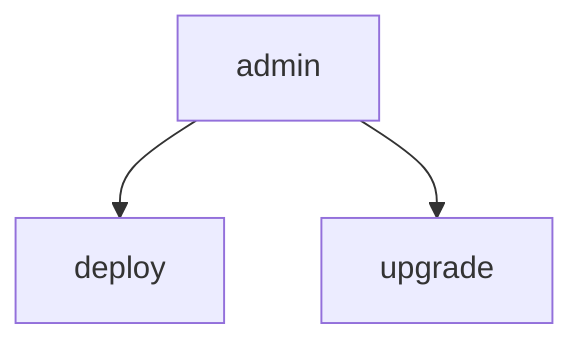
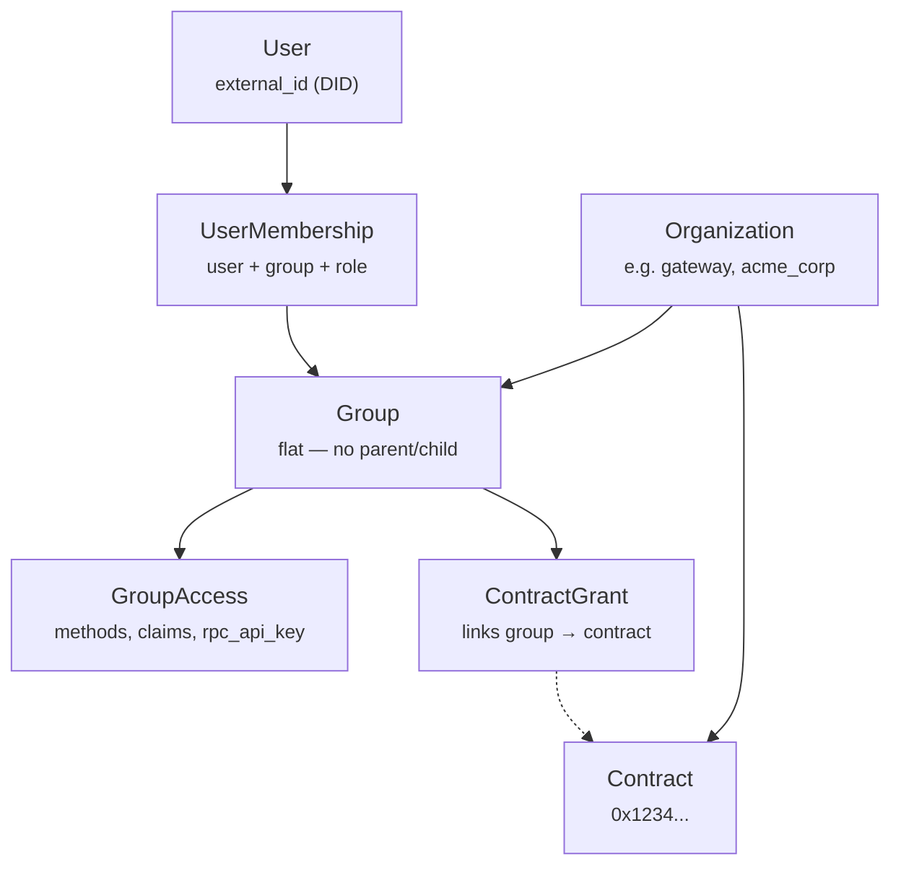
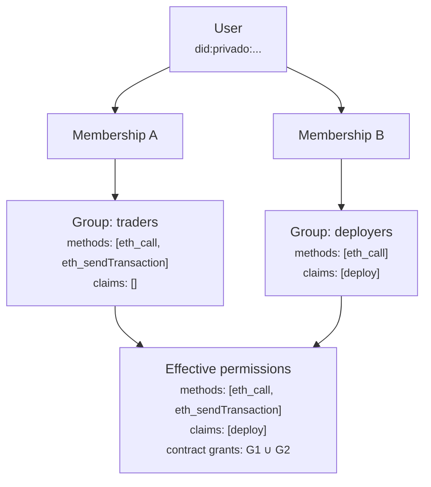

import { Callout } from "@/components/mdx/callout";
import { ApiEndpoint } from "@/components/mdx/api-endpoint";
export const metadata = {
  title: "RBAC",
  description:
    "Multi-tenant role-based access control for blockchain node access.",
};

# Role-Based Access Control (RBAC)

## Overview

The Open Privacy Suite implements a **multi-tenant RBAC** system that protects blockchain
node access. Organizations define fine-grained permissions for users accessing JSON-RPC methods and
smart contracts.

**Key features:**

- **Multi-tenant** -- multiple independent organizations with isolated permission sets
- **Flat groups, UNION across memberships** -- each user can belong to multiple groups; effective permissions are the UNION of every membership's grants. The legacy parent/child group hierarchy was removed when groups became flat; the resolver no longer walks `parent_id` even though the column persists on the schema for compatibility.
- **Dual membership** -- users can be assigned via admin API or ZK-attested credentials
- **Contract ownership** -- track deployed contracts and define owner capabilities
- **Caching** -- in-memory and database-level caching for high-performance access checks
- **Immediate propagation** -- permission changes (group access, memberships, contract grants) take effect immediately, no restart or cache wait required

---

## Simplified Permission Model (TL;DR)

The RBAC system uses a **two-layer permission model**: a method allowlist controls which RPC methods a group can call, and operational claims (`deploy`, `upgrade`, `admin`) gate specific high-privilege operations.

1. **Method allowlist is the source of truth for non-privileged access** -- each group defines which RPC methods are permitted via `GroupAccess.allowed_methods`. If `eth_call` is not in the list, the user cannot call it. If `eth_sendTransaction` is not in the list, the user cannot send transactions.

2. **Operational claims gate privileged operations** -- only `deploy`, `upgrade`, and `admin` are claim-gated. Contract deployment requires the `deploy` claim. Proxy upgrades require the `upgrade` claim. The `admin` claim implies both.

3. **ContractGrants link groups to contracts** -- for registered contracts, a `ContractGrant` establishes which groups can access which contracts. The grant does NOT store claims; claims are inherited from the group.

4. **All contracts are private by default** -- unregistered addresses (not registered to any organization) are denied. Only EVM precompiles (0x01-0x09) are accessible without explicit registration. A contract registered to a *different* org is always denied regardless of the user's claims.

5. **Org admins bypass everything** -- groups with `is_org_admin: true` give members all claims on all contracts in the organization.

| Contract Type | Deploy/Admin Users | Standard Users |
|--------------|-------------------|----------------|
| Unregistered | **Denied** (private by default) | **Denied** (private by default) |
| EVM Precompile (0x01-0x09) | Allowed | Allowed |
| Registered (own org) | Allowed (default claims) | ContractGrant required |
| Registered (other org) | Denied (cross-org) | Denied (cross-org) |
| Self-deployed | Grant added to deployer's group | Grant added to deployer's group |
| Org admin member | All claims, all contracts | N/A |

---

## 3-Tier Admin Model

The system uses three tiers of administrative access, each scoped to a different level of the hierarchy.

### Tier 1: Token credentials (admin + operator)

Tier 1 is not a user account — it is a shared secret sent in the `X-Admin-Token` header. There are **two** Tier-1 credentials, distinguished by which configured value the header matches:

**Full admin token** (`ADMIN_API_TOKEN`) — unrestricted: reads, writes, per-org tenant data, and all platform/fleet settings, in any org. Intended for **trusted operations** held inside the deployment's own trust boundary (Gateway-run automation, the bundled MCP admin tool). Use this only where the holder is already trusted with the database.

**Operator token** (`OPERATOR_API_TOKEN`, optional) — a **restricted onboarder** credential for a party that should run the platform but not see or touch tenant data (e.g. a 3rd-party that onboards client orgs and reaches the system only through the API, with no database access). It is scoped to:

- **Organization lifecycle** — create, update, and delete organizations (tenants).
- **Minting org admins** — create `is_org_admin` / `is_org_readonly_admin` groups, set their access, and add the first members. This is how a brand-new org gets its first tier-2 admin; from there the org admin runs day-to-day onboarding themselves.

The operator token **cannot** perform per-org tenant management or read tenant data — creating/editing regular groups, setting regular-group access, registering contracts, creating grants, onboarding members into regular groups, **and reading** members / groups / contracts / grants / audit logs / per-org compliance all return `403 Forbidden`. It also cannot impersonate or dry-run as a user. Those are the org admin's job (tier-2, below), so an operator who is **not** a member of a tenant org cannot silently reshape *or inspect* that org. For an operator with no database access this is a genuine confidentiality boundary, not just accountability. The org list + org metadata stay readable (lifecycle), and the system default org/group are exempt (platform infrastructure, not a tenant). Fleet/cluster-wide settings (shared-infrastructure, base-currency *default*, Azure-tenant allowlist, global sanctions, system toggles) remain **full-admin-token only**. (Each org's *own* compliance currency is a per-org setting the org admin manages — only the system-wide default lives here.)

### Tier 2: Org Admin

Groups with `is_org_admin` enabled. Scoped to their organization:

- Full admin dashboard access for their org
- Can manage groups, users, and contract grants
- Can create groups with any claims but **cannot create other org admin groups**
- Sees all contracts in their org in the block explorer
- Bypasses event rules for org contracts
- **Access Logs are scoped to their organization** — a tier-2 admin sees only their own org's request log, never other tenants'. Super admins see the full log across all organizations. Denied requests show a **reason** (e.g. "Sender not linked", "Method not allowed") so an admin can see *why* a request failed, while the caller's own error response stays opaque.

<Callout variant="info" title="Org-admin group configuration rules">

The "org admin" role maps to several independent fields under the hood, so the proxy enforces three invariants that keep a group from being saved into a misleading or non-functional state:

- **Full admin and read-only admin are mutually exclusive.** A group is a full org admin, a read-only admin, or neither — never both. The dashboard presents them as distinct choices and the API rejects a group that sets both (`400 Bad Request`), backed by a database `CHECK` constraint.
- **The claims list does not apply to org-admin groups.** Org admins automatically receive all claims (`admin` / `deploy` / `upgrade`) on every contract in the org, so a per-group claims list would be misleading. The dashboard hides the claims editor for org-admin groups and the API rejects a non-empty claims list (`400`).
- **An org-admin group must allow at least one method.** A group with all claims but no allowed methods can call nothing. The dashboard requires a method preset and the API rejects an empty method list (`400`). The method allowlist stays the source of truth for which RPC methods the group can call — org admins are **not** implicitly granted every method.

</Callout>

### Tier 3: Contract Admin

Groups with the `admin` claim on specific contracts (via contract grants):

- Full access to granted contracts only (bypasses event rules, sees all storage)
- **No** admin dashboard access
- **No** org-wide visibility
- Cannot manage users or groups

### Escalation Prevention

No user can grant permissions at their own level or higher:

- Org admins cannot create org admin groups
- Contract admins cannot access the admin API
- Only super admins can grant org admin status

Because granting org-admin status creates a peer who could ban or demote the granter, **every operation that confers, removes, or reshapes org-admin membership is restricted to super admins** — not just group creation. A tier-2 org admin attempting any of the following gets `403 Forbidden`:

- Adding a member to an org-admin group (by UUID or by DID onboarding)
- Removing a member from an org-admin group
- Deleting an org-admin group (including via batch delete — the whole batch is rejected)
- Editing an org-admin group's access (allowed methods, claims)

Read-only admin (`is_org_readonly_admin`) groups are **not** restricted this way: a tier-2 admin may freely assign, remove, and manage read-only admins, since that role is a strict subset of their own permissions (delegation, not escalation).

To match this, the dashboard hides org-admin groups from the user-onboarding and add-membership group pickers for tier-2 admins, so they are not offered an option the server would reject. The server-side `403` remains the enforced boundary regardless of the UI.

### You Cannot Ban Your Own Account

An org admin cannot ban themselves. Setting `banned` on your own user returns `400 Bad Request`.

Banning revokes the target's refresh tokens immediately, and a banned user is rejected on every subsequent request — so banning yourself would end your own session on the spot, accidentally or otherwise. Because the restricted operator token is not permitted to modify users, undoing it requires the **full admin token**. In an organization with a single admin, that means the organization cannot restore its own access.

- **Un-banning yourself is not blocked.** It is the recovery direction, and a banned admin cannot reach the endpoint anyway.
- **Banning other users is unaffected**, as is editing your own KYC status or note.
- **The full admin token is not restricted** — it may ban any user, including an admin.

In the dashboard the Ban control on your own account is inert and states the reason — as a tooltip on the user list row, and as help text beside the toggle on the user detail page. Both remain reachable by keyboard, so the explanation is not mouse-only. As always the server-side check is the boundary; the UI only avoids offering an action that would fail.

To ban an admin, have another admin in the same organization do it, or use the full admin token.

---

## Claims Hierarchy

Claims are capability tokens that grant specific actions. Higher-level claims imply lower-level ones.



`ExpandClaims()` normalizes implied claims before saving on the backend. Only three claims gate behavior today; the legacy `read` and `write` claims were removed — non-privileged method access is now the exclusive job of the per-group method allowlist.

| Claim | Purpose | Required For |
|-------|---------|--------------|
| `deploy` | Deploy new contracts | `eth_sendTransaction` with empty `to`, `eth_estimateGas` for deployment |
| `admin` | Full administrative access | All operations including deployment; implies `deploy` + `upgrade` |
| `upgrade` | Upgrade proxy contracts | `upgradeTo()`, `upgradeToAndCall()` on proxy contracts |

Non-privileged method access (reads + non-mutating calls + ordinary writes) is controlled entirely by the method allowlist. If `eth_call` is in a group's allowed methods, members can read contract data. If `eth_sendTransaction` is in the list, members can send transactions. No additional claim is needed.

<Callout variant="info" title="Tracing is gated by the allowlist">

The `debug_traceTransaction` and `debug_traceCall` methods are gated by the method
allowlist like every other RPC method: a group can use them only if they appear in that
group's allowed methods (or the group allows all methods). The `deploy` claim does **not**
grant tracing — a group that holds `deploy` but does not list `debug_trace*` in its allowed
methods cannot trace. This includes **org-admin groups**: an org-admin group that should be
able to trace must include `debug_traceTransaction` / `debug_traceCall` (or `*`) in its
allowed methods. Cross-organization isolation on trace results is always enforced separately,
regardless of the allowlist.

</Callout>

---

## Architecture



### Key entities

- **Organization** -- top-level tenant with a unique slug, display name, and custom settings (JSONB)
- **Group** -- permission container scoped to an organization. **Flat** — the `parent_id` and `path` columns persist on the schema but the resolver no longer walks them. Users get UNION of every group they're a member of.
- **GroupAccess** -- defines allowed methods, claims, and an optional RPC API key for a group
- **ContractGrant** -- links a group to a contract; optionally restricts callable functions via `FunctionRule` and parameter constraints via `ParamRule`
- **UserMembership** -- assigns a user to a group with a role
- **Role** -- named set of claims (e.g., "deployer" with `[deploy]`)

---

## Permission Evaluation Flow

<Callout variant="info" title="How permissions are computed">

1. **Group has methods + claims** via GroupAccess: `{ methods: [...], claims: [deploy] }`. The method list is the sole gate for non-privileged methods; the `admin`, `deploy`, and `upgrade` claims gate the corresponding privileged operations.
2. **Unregistered contracts**: denied (private by default). Only EVM precompiles (0x01-0x09) are accessible. All other contracts must be registered to an org.
3. **Registered contracts**: require a `ContractGrant` on the user's group. The `admin` and `deploy` claims alone do **not** unlock registered contracts — tier 3 admins get RBAC bypass only on contracts explicitly granted to their group (per the 3-tier admin model). Functions can be restricted via `FunctionRule`. Parameters can be constrained via `ParamRule`.
4. **Deployer contract grant**: when a user deploys a contract, a `contract_grant` is added to their existing deploy group. The admin must pre-create a group with the `deploy` claim and add deployers to it.
5. **Org admin bypass**: groups with `is_org_admin=true` (tier 2) get ALL claims on ALL contracts in the organization — this is how org admins see every org contract at both the RPC and explorer layers.

<Callout variant="info" title="Access/visibility symmetry">
RPC access and explorer visibility share the same grant model. If a user can call a contract via RPC, they see it as **Full** in the explorer; if they cannot call it, it shows as `[PRIVATE]` or is hidden. Any asymmetry is a bug — the invariant is enforced by an integration test.
</Callout>

</Callout>

---

## Group Membership and Permission Aggregation

Groups are **flat** — a group's effective permissions are exactly its own `GroupAccess` + `ContractGrant` set. There is no parent/child walk, no path-based inheritance, no INTERSECTION across a chain. The resolver's hierarchy traversal was removed; the schema columns (`parent_id`, `path`, `depth`) are kept for back-compat but the runtime ignores them.



A user can belong to multiple groups. Across memberships:

1. Compute permissions for each membership directly from the group's `GroupAccess` and `ContractGrant` rows (no traversal — see `resolver.go:computeGroupPermissions`, comment `// (flat — no hierarchy walk)`).
2. Apply **UNION** across all memberships — methods, claims, and contract grants are all combined. A user gets the **most permissive** combined view of every group they belong to.
3. Rate limiting is **not** aggregated per membership — the proxy forwards the caller's resolved group RPC API key (or the global fallback) upstream, and request-rate quotas are enforced by the upstream RPC proxy against that key.

### Time-boxed memberships (access windows)

A membership can carry an optional **expiry**. When you add a member — via the admin API (`expires_at`, an RFC3339 timestamp) or the dashboard's **Access window** selector (24 hours / 7 days / 30 days / a custom date) — access is granted only until that moment. Once the window passes, the membership stops contributing any methods, claims, or data visibility and is cleaned up automatically; the user falls back to whatever their remaining memberships allow (typically none). Leave the window unset for a permanent membership.

This is the mechanism for **time-limited observer access** — for example a regulator or auditor onboarded into a read-only group for a fixed engagement window, after which their access ends on its own. Revocation applies to both direct RPC and the Block Explorer. To revoke before the window ends, remove the membership (effective immediately).

In the dashboard, a time-boxed membership shows an **Expires &lt;date&gt;** badge — and **Expired** once the window has passed, with the row de-emphasised — so an operator can see at a glance which grants are temporary and which have already lapsed.

---

## Contract Access Rules

### Function Selectors

For fine-grained control, `ContractGrant.Functions` can restrict which functions users can call on
a specific contract.

```json
{
  "functions": [
    { "selector": "0x70a08231" },
    { "selector": "0xa9059cbb", "param_rules": [{ "index": 0, "must_be": "self" }] }
  ]
}
```

Common ERC20 selectors:

| Selector | Function |
|----------|----------|
| `0xa9059cbb` | `transfer(address,uint256)` |
| `0x095ea7b3` | `approve(address,uint256)` |
| `0x70a08231` | `balanceOf(address)` |
| `0x23b872dd` | `transferFrom(address,address,uint256)` |

If `functions` is empty or null, all functions are allowed. Selectors are case-insensitive.

### Parameter Constraints

Function rules and event rules can include `param_rules` to enforce constraints on individual parameters:

- **Prerequisite:** the contract must have its ABI uploaded (or a `token_type` set for built-in ABI fallback)
- **Constraint `"self"`:** the parameter (must be an `address` type) must match one of the caller's linked ETH addresses
- **Custom hex addresses:** for event rules, a literal `0x...` address can be specified to filter events by a specific party. Custom hex addresses are subject to **cross-org boundary enforcement** (see below)
- **Function param_rules apply to:** `eth_sendTransaction`, `eth_call`, `eth_estimateGas`, `eth_sendRawTransaction`
- **Event param_rules apply to:** `eth_getLogs`, `eth_getTransactionReceipt` (log filtering)

#### Cross-Org Boundary Enforcement

Custom hex addresses in event param rules are validated at grant creation and update time:

- **Same-org addresses:** allowed (contracts, preregistered addresses, or EOAs linked to users in the grant's organization)
- **Cross-org addresses:** rejected — addresses belonging to a different organization cannot be referenced
- **Unregistered addresses:** rejected (fail-closed) — addresses not verifiably belonging to the grant's organization are denied
- **Multi-org users:** if an EOA is linked to a user who belongs to multiple organizations, the address is allowed if any of those organizations matches the grant's organization

This prevents an admin from configuring event rules that target users or contracts in other organizations, which would bypass the disclosure request flow.

<Callout variant="warning" title="Known limitations">

- `eth_getStorageAt` uses tiered access (admin: all slots, non-admin: EIP-1967 proxy infrastructure slots only) which limits but does not fully prevent storage-level reads -- the four allowed proxy slots expose implementation/admin addresses only
- Internal calls within contracts cannot be intercepted
- Users without a linked ETH address cannot access functions with param constraints

</Callout>

### Multi-Organization Users

Users can be members of groups in multiple organizations. The system resolves organization context
based on the **target contract**:

| Target | Org Context | Behavior |
|--------|-------------|----------|
| Contract owned by Org A | Org A | Use Org A memberships |
| Contract owned by Org B | Org B | Use Org B memberships |
| Unregistered contract | -- | **Denied** (private by default) |
| EVM precompile (0x01-0x09) | N/A | Allowed (read access) |
| Contract in Org C (user not member) | -- | Request denied |
| No target (deployment) | User's default org | Use default org memberships |

**Note on "unregistered" contracts:** Contracts deployed through the proxy are **never unregistered** — they are pre-registered to the deployer's org before the transaction is forwarded to the node, closing any race window. All unregistered addresses are private by default. If a contract exists on-chain but was not deployed through the proxy (e.g., system/genesis contracts), it must be claimed via the admin API (`POST /orgs/:org_id/contracts/claim`) to become accessible.

---

## Granting access (admin UI walkthrough)

The admin dashboard's "Add Group Access" form is the canonical way to attach a group to a contract. The form is a **two-step wizard** (split out in the contract-grant refactor) — step 1 is "who can access and which functions"; step 2 is "which events are visible to that group".

### Step 1 — Group + functions

- **Select Group**: the dropdown lists every group in the org that does not already have a grant on this contract. Groups already granted are filtered out; to edit an existing grant, use the pencil icon on that grant card instead.
- **Selected group's permissions panel**: shows the chosen group's `allowed_methods` + claims for context. If a group lacks the `deploy` claim, the `deploy` checkbox is shown in step 2 as opt-in but the form warns that this won't take effect unless the group's `GroupAccess` also includes `deploy` (mismatch is rejected server-side with a 400).
- **Function mode** — radio:
  - *All functions allowed* (default) — `functions = null` server-side; the group can call every method the contract exposes (subject to the allowlist).
  - *Specific functions only* — opens a function picker (uses the contract's ABI if registered); selected functions become `FunctionRule[]`. Each rule can pin address-typed params (`must_be: self`, `must_be: <hex>`) via the param-constraint UI.
- **Claims checkboxes** — `deploy` and `upgrade` are now exposed as explicit per-grant checkboxes. They take effect only on this contract for this group; granting `deploy` on a single contract does NOT widen the group's overall deploy claim.
- **"Next" button** — enabled once a group is selected and (if "specific functions" is chosen) at least one function is added. Advances to step 2.

### Step 2 — Events

- **Event mode** — radio:
  - *No events visible* (default for new grants) — `event_rules = []` server-side; no event logs are visible to this group.
  - *All events visible* — `event_rules = "*"` (the wildcard sentinel); every event the contract emits is visible (subject to redaction).
  - *Specific events only* — opens an event picker populated from the contract's ABI. Each selected event becomes an `EventRule` with an optional `param_rules[]` array constraining address-typed indexed parameters.
- **Contract without an ABI**: the picker is replaced by a warning that no ABI is registered. The grant can still be saved at "No events visible" or "All events visible", but "Specific events only" is rejected — the proxy cannot decode events without an ABI, so admins are forced to either upload an ABI or set the contract's `metadata.token_type` to a built-in registry value (`"ERC20"` or `"ERC721"`) before specific event rules become saveable.
- **Save** — labelled "Create Grant" for new grants and "Save Changes" when editing. The button is disabled until the form's validation state is clean.

### Editing an existing grant

Each grant card on a contract's permissions dialog has two pencil icons:

- **Edit function access** — opens the form in `editMode='functions'` with only step 1 content. Group is fixed; functions can be edited; events are preserved unchanged.
- **Edit event visibility** — opens the form in `editMode='events'` with only step 2 content. Group + functions are preserved; events can be edited.

This split lets reviewers update one axis without the wizard's "are you sure you didn't change anything else?" surface. The full two-step wizard is reachable only via "Add Group Access".

<Callout variant="info" title="Default group is system-protected">
  The default group on each org is marked `is_system = true`. Its `GroupAccess` row exists at org-create time and represents the baseline permissions for new users. Mutations to the default group's name/description/admin-flag are blocked at the API layer (`409 Conflict` with a "system group" message); only the `GroupAccess` surface (allowed methods, claims, `rpc_api_key`) can be edited, and only by a super-admin or the org's tier-2 admin.
</Callout>

---

## Rate Limiting

Rate limiting is handled at the **RPC proxy API key level**, not per-group. Each group can have an
`rpc_api_key` that maps to rate limit tiers configured on the upstream RPC proxy. See the
[Per-Group RPC API Keys](#per-group-rpc-api-keys) section below for details.

---

## Per-Group RPC API Keys

Each group can have an `rpc_api_key` configured via the admin dashboard. This key is used when forwarding requests to the upstream RPC node, enabling per-group rate limiting and usage tracking.

- If a group has an API key, it is used for all requests from members of that group
- If no group-specific key is set, the global `RPC_API_KEY` is used as a fallback
- Keys are encrypted at rest in production (`RPC_API_KEY_ENCRYPTION_KEY` required)
- API keys are masked in API responses (only last 4 characters visible)

### Custom API Key Header

By default the API key is sent as `Authorization: Bearer <key>`. Some upstream RPC providers expect the key under a different header name (commonly `X-API-Key`). Both the global default and per-group override are configurable:

- Global default: `RPC_API_KEY_HEADER` (env var, default `Authorization`).
- Per-group override: `rpc_api_key_header` on each group's access settings.

Resolution order at request time: per-group value (if non-empty) → `RPC_API_KEY_HEADER` env var → `Authorization`.

Behaviour:

- When the resolved header is `Authorization` (case-insensitive), the proxy sends `Authorization: Bearer <key>` — preserving the historical format.
- For any other header name, the proxy sends the API key verbatim, e.g. `X-API-Key: <key>` (no `Bearer` prefix).

Header names are validated against `^[A-Za-z0-9-]+$` at save time to prevent header injection. Invalid values are rejected with `400 Bad Request`.

See [Configuration](/docs/configuration) for setup.

---

## Per-Group Verbose Errors

By default every denied JSON-RPC request returns an **opaque** error message — the real cause is recorded only in the admin Access Logs (scoped to your org). This protects against information leakage but makes client-side automation hard: an integration can't tell *why* a call was rejected.

Enable **Verbose error reasons** on a group's access settings (admin dashboard, or `verbose_errors: true` on the group-access API) and members of that group additionally receive a stable, machine-readable `reason` code alongside the (still opaque) `error` message on denials — for example:

```json
{ "error": "call denied: invalid request shape", "reason": "sender_not_linked" }
```

- **Default off.** With the flag off, responses are byte-for-byte identical to today (opaque).
- **Stable codes** for automation to switch on: `sender_not_linked`, `method_not_allowed`, `auth_required`, `invalid_request_shape`, `rate_limited`, `concurrency_limited`, `upstream_error`.
- **Cross-org and trace-related causes always collapse to `access_denied`** — verbose mode never reveals another tenant's contracts, ownership, or whether an address exists. Only facts about the caller's own request are exposed.
- The raw internal error is **never** sent on the wire, flag or not — it stays in server logs.
- Toggling the flag is recorded in the admin audit log.

Use it for trusted first-party integrations that need programmatic error handling; leave it off for general access.

---

## API Endpoints

For full request/response details, see the [API Reference](/docs/api).

### Organizations

<ApiEndpoint method="GET" path="/api/orgs" description="List all organizations" />
<ApiEndpoint method="POST" path="/api/orgs" description="Create organization" />
<ApiEndpoint method="GET" path="/api/orgs/:org_id" description="Get organization" />
<ApiEndpoint method="PUT" path="/api/orgs/:org_id" description="Update organization" />

### Groups

<ApiEndpoint method="GET" path="/api/orgs/:org_id/groups" description="List groups" />
<ApiEndpoint method="POST" path="/api/orgs/:org_id/groups" description="Create group" />
<ApiEndpoint method="GET" path="/api/orgs/:org_id/groups/:id" description="Get group" />
<ApiEndpoint method="PUT" path="/api/orgs/:org_id/groups/:id" description="Update group" />
<ApiEndpoint method="DELETE" path="/api/orgs/:org_id/groups/:id" description="Delete group" />
<ApiEndpoint method="PUT" path="/api/orgs/:org_id/groups/:id/access" description="Set group access (methods, claims)" />

The list groups endpoint supports optional filters:
- `?search=term` — filter by name or slug (case-insensitive)

### Contract Grants

<ApiEndpoint method="POST" path="/api/orgs/:org_id/contracts/:address/grants" description="Link a group to a contract" />

### Roles and Memberships

<ApiEndpoint method="POST" path="/api/orgs/:org_id/roles" description="Create role with claims" />
<ApiEndpoint method="POST" path="/api/users/:id/memberships" description="Assign user to a group with a role (by user UUID; target user must already be in caller's full-admin scope)" />
<ApiEndpoint method="POST" path="/api/orgs/:org_id/memberships/by-did" description="Onboard by DID — tier-2 admin pulls a DID into their own org without a super-admin handoff" />

#### User-scope gate on `POST /users/:id/memberships`

The by-UUID membership endpoint requires the target user to already be in the caller's full-admin scope: at least one of the user's existing memberships must live in an org the caller `is_org_admin` of. Pre-fix, the handler's response codes formed a user-enumeration oracle —

| Response | Meaning |
| -- | -- |
| `201 Created` | UUID exists, not yet in group |
| `409 Conflict` | UUID exists and is already in group |
| `500 Internal Server Error` | UUID does NOT exist (FK violation) |

— so a tier-2 admin who learned a foreign UUID (via logs, support ticket, screenshot) could verify "this user exists" by attempting an add. UUID space (128 bits) was the only barrier and the response-code distinction turned the handler into a clean primitive for any future leak.

Post-fix the gate fires at the top of the handler and returns the opaque `errTargetForeignOrg` shape for both "UUID doesn't exist anywhere" and "UUID exists in another org you don't admin". Onboarding a previously-unseen DID into your org goes through `POST /orgs/:org_id/memberships/by-did` instead — that endpoint auto-provisions the user and inserts the membership in one round trip, no UUID and no super-admin handoff.

#### Onboarding by DID

`POST /api/v1/admin/orgs/:org_id/memberships/by-did` is the canonical path for a tier-2 org admin to add a user to their own org when they only know the user's DID. Previously the only way to do this was to ask a super-admin to look up the DID's UUID and pass it back — tier-2 admins were structurally blocked even though the action was within their authority.

Request:

```json
{
  "did":      "did:iden3:privado:main:2SaubQ6...",
  "group_id": "<group in :org_id>"
}
```

**Which DID? Use the account DID, not the wallet app's DID.** When a user opens their Privado ID / Billions wallet, the account screen shows **two** DIDs: the wallet app's own DID and the user's personal **account** DID. Onboard with the **account** DID — the identity the user actually signs in with. The two are easy to confuse, and the wrong choice fails quietly: the onboarded row never matches the user's real login DID, so they sign in successfully but without the access you intended. If an onboarded user reports "I'm logged in but have no access," suspect the wrong DID.

The endpoint validates the DID's format and, for Privado / Polygon ID DIDs, its checksum — so a mistyped or malformed DID is rejected with `400` instead of silently creating a dead row. It **cannot** tell the account DID from the app DID (both are valid DIDs), so that distinction is the operator's to get right.

Responses:

| Status | When | Body |
|---|---|---|
| `201` | Success | `{"user_id": "...", "membership": {...}}` — `user_id` is the DID's resolved UUID (existing or freshly provisioned); `membership` is the row that was just inserted |
| `400` | Body missing `did` or `group_id`, or malformed JSON | `{"error": "invalid request body"}` |
| `400` | `did` is not a valid DID, or a Privado / Polygon ID DID with a bad checksum | `{"error": "invalid did"}` — opaque; the parser detail is logged server-side only |
| `403` | Caller does not full-admin `:org_id`, OR `group_id` lives in a different org | Opaque deny — never reveals whether the group exists in another org |
| `409` | DID is already a member of `group_id` (idempotent repeat) | `{"error": "user is already a member of this group"}` |
| `500` | DB / RBAC controller failure, or defensive nil-user path | Generic; details in proxy logs only |

**Banned users return 201, not a distinguishable error.** Ban is global state an org admin shouldn't be able to enumerate by probing this endpoint — if a banned DID produced a unique status code, the endpoint would become a ban-status oracle. The membership row is inserted normally; the ban gate fires at auth-time (`auth.go` rejects token issuance for banned users), so the membership is dormant until the ban is lifted.

**Semantics**:

- **ADD, not MOVE.** The endpoint inserts a single membership row. It does NOT touch the user's `default`-org membership if one exists. Removing the user later is a separate DELETE — no cross-org cleanup, no implicit re-add to `default`.
- **Auto-provisioning.** A previously-unseen DID is created via `EnsureUserExists` with `skipDefaultGroup=true`, so the user lands in the caller's group only. If the same DID later self-authenticates, the auth flow sees an existing row and does not duplicate the default-group assignment.
- **Cross-org isolation.** The caller is gated on `admin_org_ids` containing `:org_id` (full admin, not read-only). The target `group_id` is re-verified to live in `:org_id` so a malformed group_id from another org is rejected with the opaque deny shape.
- **Audit log.** Every successful onboarding writes an `rbac_audit_log` entry (`AuditAction=assign`, `ResourceType=membership`) with the actor's DID, the target DID, and `onboarded_via: by-did` in the metadata. Combined with the hash-chain integrity ([Audit Log Integrity](/docs/security/audit-integrity)), every onboarding is tamper-evident.

## Admin dry-run / impersonation

Tier-2 org admins can ask the proxy "what would user X see if they made this RPC call?" without ever creating an impersonation token, mutating chain state, or exposing any data they don't already have.

<ApiEndpoint method="POST" path="/api/orgs/:org_id/dry-run" description="Dry-run an RPC call as another user (admin diagnostic)" />

### Who can call it

- **Tier-2 org admin** in `:org_id` — yes, via JWT.
- **Super-admin** (`X-Admin-Token`) — **no**, rejected with 403. Super-admin manages admins; this endpoint is for inspecting user-shaped views, which super-admin doesn't otherwise have data-layer reach into.
- **Tier-3 admin** (per-contract admin claim, no `is_org_admin`) — no, rejected by org-scoping middleware.
- **Read-Only Admin** (when shipped) — no.

### Request

```json
POST /api/orgs/:org_id/dry-run
{
  "user_did": "did:example:bob",
  "rpc": {
    "method": "eth_sendTransaction",
    "params": [{ "from": "0xbob...", "to": "0xcontract...", "data": "0xabcd" }]
  }
}
```

### Response

```json
{
  "decision": "allow" | "deny",
  "reason":   "...",
  "response": <redacted-as-user response, for non-mutating methods>,
  "trace":    <debug_traceCall output, for mutating methods>,
  "logs_emitted":          [...],
  "logs_visible_to_user":  [...]
}
```

Non-mutating methods (`eth_call`, `eth_getLogs`, `eth_getTransactionReceipt`, `eth_getTransactionByHash`, `eth_getBalance`, `eth_getCode`, `eth_getStorageAt`, `eth_blockNumber`, `eth_chainId`) pass through to the upstream node and return the user's would-be response.

Mutating methods (`eth_sendTransaction`) are translated to `debug_traceCall` against the upstream node — current state, no commit. The trace returns nested call frames + emitted logs; the proxy walks the frames and runs the logs through the impersonated user's RBAC view, returning both the full event list (`logs_emitted`) and the subset the user would actually see (`logs_visible_to_user`).

### Operational requirements

- The upstream node must expose `debug_traceCall` for mutating-method dry-run to work (Geth: `--http.api debug`). If unavailable, mutating calls return a clear error; non-mutating methods continue to work.
- All dry-run calls are recorded in the `impersonation_log` table with the actor's DID, the impersonated user's DID, the method, a SHA-256 hash of the params (raw params are never persisted), the decision, and a correlation ID. Operators are expected to forward this log to their SIEM via the existing `audit-forwarder` integration.
- Dry-run results have no side effects on chain state, no caching that would survive past the request, and no JWT minting at any point. The "impersonated" identity exists only inside one request handler.

### Limitations

- Cross-org impersonation is structurally blocked (admin in Org A can only dry-run or browse as users with a membership in Org A).
- Dashboard View-as is read-only and scoped to one explicit organization. It applies the target user's visibility without merging the admin's broader grants; see [View as user](/docs/security/view-as-user).
