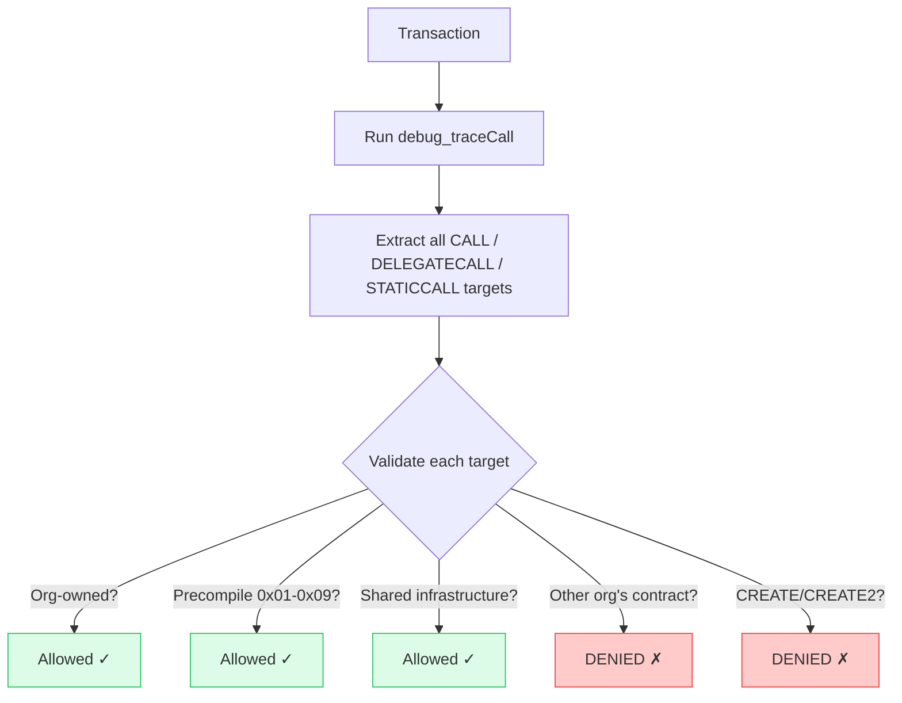
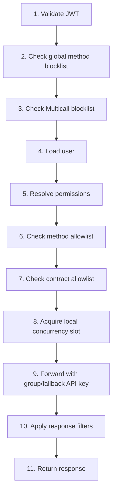

import { Callout } from "@/components/mdx/callout";
export const metadata = {
  title: "Security Features",
  description:
    "Request filtering, response-level privacy filtering, cross-organization isolation, authentication, authorization, and admin API protection in the Open Privacy Suite.",
};

# Security Features

The Open Privacy Suite implements defense-in-depth security across every layer of the request pipeline. This page covers request filtering, cross-org isolation, authentication and authorization security, admin API protection, and production hardening. For response-level privacy filtering (what data users see within allowed responses), see the dedicated [Response-Level Privacy Filtering](/docs/security/response-filtering) page. For audit-log tamper-evidence (SHA-256 hash chain, scheduled verification, role separation), see [Audit Log Integrity](/docs/security/audit-integrity).

---

## Request Filtering

### Global Method Blocklist

Dangerous JSON-RPC methods are blocked regardless of user permissions:

| Method Pattern | Reason |
|----------------|--------|
| `debug_*` | Tracing/debugging (info disclosure, DoS) |
| `admin_*` | Node administration |
| `personal_*` | Account management (key exposure) |
| `miner_*` | Mining control |
| `txpool_*` | Mempool inspection (MEV risk) |
| `clique_*` | Consensus manipulation |
| `les_*` | Light client protocol |
| `eth_sign` | Arbitrary message signing |
| `eth_signTransaction` | Transaction signing |
| `eth_subscribe` | WebSocket subscriptions (bypasses filtering) |
| `eth_unsubscribe` | WebSocket subscriptions |

**Exception:** `debug_traceCall` and `debug_traceTransaction` are *not* blocked by the `debug_*` rule — they are gated by the group method allowlist plus cross-org trace validation (they power the runtime validation below). All other `debug_*` methods are blocked.

**`eth_getStorageAt`** is not globally blocked but uses **tiered access based on claims**: admin users get unrestricted access to all storage slots, non-admin users can query only EIP-1967 proxy infrastructure slots, and users with no claim are blocked. See [Response Filtering](/docs/security/response-filtering#eth_getstorageat----tiered-access) for the full list of allowed slots.

### eth\_sendRawTransaction Support

`eth_sendRawTransaction` is fully supported. The proxy:

1. **Decodes the RLP transaction** to extract `from`, `to`, `data`, and `value` fields
2. **Recovers the sender address** from the transaction signature using the chain ID
3. **Runs full RBAC access checks** using the extracted transaction fields
4. **Executes runtime trace validation** via `debug_traceCall` to validate all call targets
5. **Forwards the raw transaction** to the node only if all checks pass

### Batch Request Prevention

JSON-RPC batch requests (`[{...},{...}]`) are rejected outright. This prevents:

- Bypassing per-method access control
- Amplification attacks
- Hidden dangerous method calls within a batch

### Multicall Detection

Calls to known Multicall contracts are blocked because they allow batching arbitrary contract calls, bypassing method-level restrictions:

| Contract | Address |
|----------|---------|
| Multicall3 | `0xcA11bde05977b3631167028862bE2a173976CA11` |
| Multicall2 | `0x5ba1e12693dc8f9c48aad8770482f4739beed696` |
| Multicall1 | `0xeefba1e63905ef1d7acba5a8513c70307c1ce441` |

### Contract Deployment Protection

Contract deployments require the `deploy` claim:

| Method | Deployment Detection | Validation |
|--------|---------------------|------------|
| `eth_sendTransaction` | Missing/empty/null `to` field | Requires `deploy` claim + pre-registers address |
| `eth_estimateGas` | Missing/empty/null `to` field | Requires `deploy` claim |

Deployments are protected by three mechanisms — there is **no** static bytecode/opcode analysis (the deploy path does not scan for CREATE opcodes or inspect CALL targets in the bytecode):

- **`deploy` claim** — only callers holding the `deploy` claim may deploy.
- **CREATE-address pre-registration** — the deterministic contract address is computed and registered to the deployer's org *before* the transaction is forwarded, closing the cross-org access window (see [Plain CREATE Pre-registration](#plain-create-pre-registration)).
- **Runtime `debug_traceCall` frame validation** — the constructor is traced and every internal CALL/CREATE target is validated against the org-ownership rules described below. In production the deploy is traced; if `debug_traceCall` is unavailable the transaction **fails closed** (`403 transaction denied: tracing temporarily unavailable`) rather than downgrading to a weaker check.

### Runtime Transaction Validation

Every transaction that carries calldata or targets a contract is traced using `debug_traceCall` before being forwarded to the node (simple value transfers to EOAs are exempt):



**Benefits:**

- Catches all internal calls, including from custom multicall contracts
- Validates dynamic DELEGATECALL targets that cannot be known at deployment
- Provides comprehensive cross-org isolation
- Defense-in-depth: the authoritative cross-org gate on every internal call target

**Read-side coverage.** The same trace-and-validate flow is applied to `eth_call`. Without it, a same-org wrapper contract could STATICCALL/DELEGATECALL into another organization's private contract and bubble up state through the return value, defeating cross-org isolation on the read path. Tracing on `eth_call` is uncached because proxy contracts (EIP-1967, Diamond, Beacon, transparent upgradeable) can re-target their internal calls by rewriting a storage slot. See [Configuration](/docs/configuration#runtime-tracing) for the rollback knob and the per-call timeout. `eth_estimateGas` is gated at the entry-point address.

**Performance:** approximately 50--200 ms additional latency per transaction. Tiered validation skips tracing for calls to known org-owned addresses.

---

## Response-Level Privacy Filtering

Request filtering controls which methods and contracts a user can access. Response filtering is the second layer: it controls what data a user sees within those responses. This is essential for financial privacy -- without it, all participants with read access to a contract would see every other participant's transaction calldata, event log parameters, and nonces.

The proxy applies per-method response filters **after** receiving the node's response and **before** returning it to the client:

| Method | Filtering behavior |
|--------|-------------------|
| `eth_getStorageAt` | Tiered access: admin (all slots), non-admin (EIP-1967 proxy slots only), no claim (blocked) |
| `eth_getTransactionByHash` | Returns `null` if user is not a participant (`from`/`to` match) |
| `eth_getTransactionReceipt` | Strips `logs` and `logsBloom` for non-participants; preserves execution metadata |
| `eth_getLogs` | Per-log-entry filtering based on indexed topic address matching |

Participant status is determined by comparing the user's **linked ETH addresses** (verified via EIP-191 signature through the `/eth/link/challenge` + `/eth/link/verify` flow) against transaction `from`/`to` fields or indexed event topics.

<Callout variant="info" title="Full documentation">
  For complete details on each method's filtering logic, topic matching rules, known limitations, and compliance mapping, see [Response-Level Privacy Filtering](/docs/security/response-filtering).
</Callout>

---

## Log Access Control

Event logs emitted by smart contracts are filtered before being returned to the caller. This applies to both `eth_getLogs` responses and the `logs` array within `eth_getTransactionReceipt` responses.

### Filtering Modes

The proxy uses allowlist-based log filtering. Only logs matching explicitly configured event rules are visible:

| Configuration | Behavior |
|------|----------|
| **No event rules** (`event_rules: null` or `[]`) | All logs denied -- no events visible |
| **Event rules configured** (`event_rules: [...]`) | Only logs whose `topic0` matches an allowed event rule pass; optional `param_rules` with `"self"` constraints further restrict by requiring the user's address in specific parameter positions |

To grant a group access to specific events, add event rules to their contract grant. Unconstrained address parameters are automatically restricted with `must_be: "self"` when the contract has an ABI.

### Admin Bypass

Users with the **admin claim** on a contract see ALL logs from that contract, bypassing both address-based filtering and event rule restrictions. This includes:

- Logs where the user's address does not appear in any topic
- Logs from events not in the allowlist
- Anonymous events (logs with no topics)
- Logs that would be blocked by empty event rules (`[]`)

The admin bypass applies per-contract: having admin on contract A does not grant bypass on contract B. The user must have the `admin` claim specifically on the contract that emitted the log.

**Org admins** (members of a group with `is_org_admin = true`) automatically receive the `admin` claim on all contracts in their organization via the permission resolver. This means org admins see all logs from all org contracts without restriction.

<Callout variant="info" title="Claim hierarchy">
  The `admin` claim implies `deploy` and `upgrade` (the legacy `read`/`write` claims were removed). Users without the admin claim do NOT get the admin log bypass — they are subject to normal event filtering.
</Callout>

### Cross-Organization Isolation

Logs from contracts the user has **no access to** are silently dropped. Since `EffectivePermissions.GetContractAccess()` returns `nil` for contracts in other organizations, cross-org log isolation is enforced at the same layer as log filtering. A user in Org A will never see logs emitted by contracts registered to Org B, even if their address appears in the log topics.

### Anonymous Events

Anonymous events (Solidity `event` declarations with the `anonymous` keyword) emit logs with an empty topics array -- there is no `topic0` event signature hash. In allowlist mode, anonymous events are always blocked because there is no `topic0` to match against rules. In default mode, anonymous events are blocked because the address-in-topic check finds no topics to scan. The admin bypass is the only path that includes anonymous events.

### Fail-Closed Behavior

The log filter is fail-closed at every level:

| Failure | Result |
|---------|--------|
| `perms` is `nil` (permission resolution failed) | All logs denied |
| Log entry is malformed JSON | Log dropped |
| ABI not available for param rule decoding | Param rule fails to match (log hidden) |
| Param index out of range | Param rule fails to match (log hidden) |
| Log data truncated or invalid | Param rule fails to match (log hidden) |
| `eth_getLogs` response is not a JSON array | Empty array returned |

### Token Transfer Metadata

Token transfers shown in the block explorer are derived from `Transfer` event logs. The same event access rules apply: if a viewer does not have event/log access to a contract, token transfer counts and categories are stripped from transaction metadata, and the `/transactions/:hash/transfers` endpoint returns no results for that contract. Admins and org admins bypass this restriction.

### `eth_getTransactionReceipt` Log Filtering

For transaction receipts, the proxy first checks whether the caller is a participant (`from` or `to` matches a linked address). Non-participants receive `null`. For participants, the receipt's `logs` array is filtered using the same `FilterEventLogs` logic described above, and the `logsBloom` is zeroed (since it no longer reflects the actual log set).

---

## Cross-Organization Isolation

### Organization Context Resolution

When a user accesses a contract:

1. The system looks up which organization owns the target contract
2. Verifies the user has membership in that organization
3. Uses that organization's permission context for access checks

### Isolation Rules

- Users can only access contracts owned by organizations they belong to
- **All contracts are private by default** — unregistered addresses (no registered owner) are denied. Only EVM precompiles (0x01-0x09) are truly public
- Contracts deployed through the proxy are **never unregistered** — they are pre-registered to the deployer's org before the tx is forwarded
- **Deploying contracts by bypassing the proxy is strongly discouraged and should be treated as an exception.** The proxy is the sole privacy and access control gateway — bypassing it means the contract is not automatically registered, not subject to RBAC, and not tracked in the audit trail. If a bypass deployment is unavoidable (e.g., genesis contracts, system upgrades via node console), the contract must be claimed afterwards via the admin API.
- To claim an on-chain contract not deployed through the proxy, use `POST /orgs/:org_id/contracts/claim` with the `deployment_tx_hash` — the proxy verifies the receipt and bytecode before registering
- Contract addresses are globally unique across all orgs — one org cannot claim an address already registered to another
- A contract registered to another org is **always denied**, regardless of the requester's claims
- Deploy/admin users can access registered contracts in their own org via default claims (no explicit grant needed)
- Regular users (without deploy or admin claims) must have an explicit `ContractGrant`

### Per-Address Access Checks

All methods that accept a target address enforce cross-org isolation at the address level, not just the method level. This includes:

| Method | What it returns | Why it's gated |
|--------|----------------|----------------|
| `eth_call` | ABI-encoded return data | Contract state read |
| `eth_estimateGas` | Gas estimate | Reveals contract behavior |
| `eth_getCode` | Deployed bytecode | Contract internals |
| `eth_getBalance` | Native ETH balance | Financial data |
| `eth_getTransactionCount` | Nonce (tx count) | Activity tracking |
| `eth_getProof` | Balance + nonce + storage proof | Combines balance and storage |
| `eth_createAccessList` | Storage slots and addresses accessed | Contract internals |
| `eth_sendTransaction` | Submits transaction | Write access |

`eth_getStorageAt` uses **tiered access based on claims** (admin: all slots, non-admin: EIP-1967 proxy slots only, method not in allowlist: blocked). See [Response Filtering](/docs/security/response-filtering#eth_getstorageat----tiered-access) for details.

### Plain CREATE Pre-registration

When a user with the `deploy` claim sends `eth_sendTransaction` without a `to` address (plain CREATE deployment), the proxy:

1. Computes the deterministic CREATE address from `keccak256(rlp([sender, nonce]))` before forwarding
2. Pre-registers the address to the deployer's organization immediately, closing the cross-org access window
3. Forwards the transaction to the node
4. On successful mining: finalizes the pre-registration as a full `Contract` record (`auto_registered: true`, `via: plain_create`)
5. On revert or failure: deletes the pre-registration

This ensures that from the moment the transaction is forwarded, the freshly deployed address belongs to the deployer's org and cannot be accessed by users in other organizations.

### Multi-Organization Users

Users can be members of multiple organizations. The system:

1. Determines org context from target contract ownership
2. Loads permissions from the correct organization
3. Rejects requests where the target contract belongs to an org the user is not a member of

### Event Param Rule Cross-Org Enforcement

Event rules on contract grants can include `param_rules` with custom hex addresses (e.g., `Transfer(from=0xAlice)`). These are validated at grant creation and update time:

- Custom hex addresses on address-type parameters must belong to the grant's organization (verified against registered contracts, preregistered addresses, and linked EOAs)
- Addresses belonging to a different organization are rejected with a 403 error
- Unregistered addresses (not in any org) are rejected (fail-closed)
- `"self"` constraints and non-address parameter types are not subject to cross-org checks
- Multi-org users: an EOA is allowed if its owner belongs to the grant's organization (even if also in other orgs)

This prevents admins from configuring event filters that target users or contracts in other organizations, which would bypass the disclosure request flow.

### eth\_getLogs Cross-Org Protection

- All addresses in the filter are validated against org membership
- Mixed-org address filters are rejected
- Requests without an address filter are rejected

---

## Authentication Security

### ZK-Proof Verification

- Privado ID JWZ tokens are cryptographically verified
- Proofs are bound to specific authorization requests
- Cannot be replayed to other verifiers
- Session TTL prevents stale proofs

### JWT Token Security

| Feature | Implementation |
|---------|----------------|
| Signing | HS256 with strong secrets |
| Access TTL | 5 minutes |
| Refresh TTL | 7 days |
| Token rotation | Refresh tokens rotated on use |
| Revocation | Blacklist stored in database |

**Why 5-minute access tokens?**
Access tokens are not validated against the database on every request (no per-request DB
lookup). This means there is a window between when a user is banned and when they are
actually locked out — at most the remaining lifetime of their current access token.
Five minutes is the chosen trade-off: short enough to be operationally acceptable, long
enough to avoid excessive refresh traffic. When a user's refresh token is revoked (ban,
logout, tenant deletion), their next refresh attempt is rejected and both cookies are
cleared.

Do not increase `AccessTokenTTL` without adding a per-request revocation check
(e.g. a Redis blacklist) to close the enforcement gap.

### ETH Address Linking Security

**User-initiated links (explicit flow):**
- One-time nonce challenges with a 5-minute TTL
- EIP-191 signature verification
- Challenge bound to the user's DID
- Nonce consumed on verification (replay-proof)

**System-inferred links (`eth_sendRawTransaction` only):**
- Sender address is **cryptographically recovered** from the raw transaction signature — it cannot be forged
- Only `eth_sendRawTransaction` is eligible; `eth_sendTransaction` is excluded because the `from` field would come from user-supplied parameters rather than signature recovery
- If a system-inferred link already exists and the user later completes an explicit link for the same address, the link is upgraded to `link_type: user`

**Multiple DIDs per address:**
- A single ETH address can be linked to more than one DID (shared deployer wallets, team keys)
- When a new link would create a collision, a SIEM event `eth_address_linked_collision` is emitted with elevated severity
- Administrators can review collisions at `GET /api/v1/admin/eth-addresses/collisions` and revoke unexpected links

---

## Authorization Security

### RBAC Model

- **Flat groups**: groups are siblings, not hierarchical — each group's permissions stand alone, no parent/child traversal
- **Multi-membership**: union of permissions across memberships
- **Expiring memberships**: optional expiration timestamps
- **Immutable audit log**: all changes tracked

### Access Control Flow



### Rate Limiting

Ordinary JSON-RPC request-rate quotas are enforced by the upstream RPC proxy,
not duplicated inside Open Privacy Suite. Open Privacy Suite resolves the caller's group
API key (or the global fallback key), forwards it upstream, and uses a per-key
circuit breaker to shed requests after the upstream returns `429`.

Open Privacy Suite separately limits **concurrent in-flight work** because JWT, RBAC,
compliance, and runtime-trace processing consume local resources before a request
reaches the upstream quota:

- authenticated callers have a per-identity concurrency ceiling;
- anonymous callers share one aggregate concurrency ceiling;
- authentication endpoints have a separate IP-based brute-force limiter;
- fixed request-body, pagination, and batch limits prevent one request from
  amplifying into unbounded local or upstream work.

Concurrency limiting is intentionally not requests-per-second rate limiting.
Keeping these responsibilities separate avoids inconsistent quota accounting
between Open Privacy Suite and the upstream service that owns node capacity.

Signed transaction approvals are an exception. When they are enabled, every
transaction is simulated on the node before it is approved, and Open Privacy
Suite requests that simulation itself, not under the caller's group API key, so
the upstream quota does not bound it. Open Privacy Suite therefore limits
simulations per identity: `OPS_APPROVAL_PREFLIGHT_RATE` per second, up to
`OPS_APPROVAL_PREFLIGHT_BURST` back to back. With Redis configured the budget is
shared by all instances; without it, or while Redis is unreachable, each
instance enforces it on its own. A transaction over the budget is refused with
`429` before anything is simulated.

### Anonymous (Unauthenticated) Access

A small set of **claim-free methods** can be called without any JWT token. These return only global chain metadata that carries no per-address information:

| Method | Purpose |
|--------|---------|
| `eth_blockNumber` | Latest block height |
| `eth_chainId` | Chain identifier |
| `eth_gasPrice` | Current gas price |
| `net_version` | Network version |
| `net_listening` | Node listening status |
| `web3_clientVersion` | Client version string |

This list is seeded by migration 044 and is the exclusive source — admins editing the anonymous group_access surface is super-admin-only (`setGroupAccess` `is_system` gate).

Authenticated users can also call this same set of org-free metadata methods on `/rpc` without an `org_id` in the path. The ban gate still applies; the KYC gate does not for exactly these methods — anonymous requests get the same set with no account at all, so requiring KYC here would make a signed-in user stricter than anonymous. All other methods remain KYC-gated.

**Everything else requires authentication**, including read-only methods on unowned addresses such as `eth_getBalance`. This is not a theoretical concern -- balance polling is a practical side-channel attack:

1. An attacker polls `eth_getBalance(address)` at regular intervals
2. When the balance changes, the attacker knows the exact amount and block number
3. Cross-referencing with public block timestamps builds a financial timeline -- deposit amounts, withdrawal patterns, salary schedules -- without ever seeing a single transaction

The **pre-registration surveillance problem** makes this worse: if Alice's address is pollable today because she has not joined any organization, her entire balance history is already mapped by the time she joins one. Retroactively revoking access cannot undo the data already collected.

Unauthenticated requests that target methods outside the claim-free list receive HTTP 401 (not 403), signaling that the client should authenticate rather than that the user lacks permission. Per-request rate limiting is enforced at the upstream RPC proxy, configured per group via the group's RPC API key tier. The proxy additionally protects the node and itself: a per-API-key circuit breaker sheds load when the upstream returns rate-limit (HTTP 429) responses, and a per-user concurrency cap (`MAX_CONCURRENT_REQUESTS`) bounds simultaneous in-flight requests. Authentication endpoints have their own rate limiter.

---

## Admin API Protection

Admin endpoints (`/api/v1/admin/*`, `/api/admin/*`) are protected by three independent layers:

1. **Localhost-only middleware** -- requests must originate from private networks (`127.0.0.1`, `10.0.0.0/8`, `172.16.0.0/12`, `192.168.0.0/16`, `100.64.0.0/10`). Guards against external callers. Uses the raw TCP peer address, not `X-Forwarded-For`.
2. **`X-Admin-Token` header** -- tier 1 (super admin) M2M / bootstrap authentication. Timing-safe comparison via `crypto/subtle.ConstantTimeCompare`. Required in production. Cross-org access.
3. **JWT with org admin membership** -- tier 2 browser-based admin access. The middleware validates the JWT, looks up the user, checks ban status, then queries `IsOrgAdmin()` which joins `user_memberships → groups` and checks `is_org_admin = true` (filtering expired memberships). Contract admins (tier 3, `admin` claim only without `is_org_admin`) are rejected.

The middleware tries these in order: X-Admin-Token first, then JWT Bearer token. If neither is present and `ADMIN_API_TOKEN` is unset (dev mode only), requests pass through.

After authentication, an **org scoping middleware** enforces that JWT admins can only access their own organizations. Routes with `:org_id` in the path are checked against the user's org admin org IDs. Routes without `:org_id` (cross-org operations like user management) require super admin.

<Callout variant="warning" title="Why both layers?">
  The localhost check is the first gate but can be bypassed by a misconfigured reverse proxy that forwards external traffic on localhost, an SSRF vulnerability, or another container on the same Docker network. The token/JWT is the backstop when the network gate fails.
</Callout>

<Callout variant="danger" title="Production requirement">
  Set `ADMIN_API_TOKEN` to a strong random secret (32+ characters). Never pass this token to the frontend as a `VITE_*` environment variable -- Vite bakes env vars into the JS bundle, exposing them to every visitor. For browser-based admin access, users authenticate via Privado ID or Azure AD and receive a JWT. The user must be a member of an `is_org_admin` group for dashboard access.
</Callout>

### Escalation Prevention

Org admins (tier 2) cannot grant org admin status to new groups -- only super admins (tier 1) can set `is_org_admin: true`. Org admins can create groups with the `admin` claim (creating tier 3 contract admins), but these groups do not have dashboard access or org-wide visibility.

### Frontend Admin Gate

The admin dashboard (`/admin/*`) is protected client-side by two nested components:

1. **`RequireAuth`** -- redirects unauthenticated users to `/login`
2. **`RequireAdmin`** -- calls `/api/v1/me/admin-status` to verify the user is an org admin server-side. Non-admin users (including tier 3 contract admins) see an "Access Denied" page.

The frontend gate is a UX convenience. The actual security boundary is the backend `adminAuthMiddleware` -- admin API calls without valid credentials are rejected regardless of what the frontend shows.

### Nginx Security Headers

The production and E2E nginx configs include:

- `X-Frame-Options: DENY` -- prevents clickjacking
- `X-Content-Type-Options: nosniff` -- prevents MIME-type sniffing
- `Content-Security-Policy` -- restricts script/style/connect sources to same origin
- `Referrer-Policy: strict-origin-when-cross-origin`
- `Permissions-Policy` -- disables camera, microphone, geolocation, payment

### Azure AD Tenant Pinning

When a user first authenticates via Azure AD, their `auth_tenant_id` is set in the database. This field is **immutable after first assignment** -- enforced at the SQL level (`UPDATE ... WHERE auth_tenant_id IS NULL`). If a user later attempts to log in from a different Azure AD tenant, the request is rejected with HTTP 403. When an Azure AD tenant is deleted from the allowlist, all users bound to that tenant are automatically banned and their refresh tokens revoked.

### Trusted Proxies

`X-Forwarded-For` headers are only trusted from:

- `127.0.0.1`
- `172.16.0.0/12` (Docker networks)

---

## Production Deployment Security

### Network Architecture

The Open Privacy Suite has three categories of endpoints with different network requirements:

| Category | Endpoints | Who calls it | Network access |
|----------|-----------|-------------|----------------|
| **Public** | `/auth/*`, `/rpc`, `/health` | Wallets, browsers, scripts | Internet (via reverse proxy) |
| **Internal** | `/api/v1/explorer/*`, `/metrics` | Block explorer backend, monitoring | Private network only |
| **Admin** | `/api/v1/admin/*` | Admin dashboard, scripts | Private network + auth token |

<Callout variant="danger" title="Never expose port 8080 directly to the internet">
  The backend listens on port 8080 and relies on network-level isolation for internal and admin endpoints. In production, only the reverse proxy (Caddy/nginx) ports (80/443) should be publicly accessible. The reverse proxy forwards requests to the backend over the Docker internal network, where `localhostOnlyMiddleware` allows them.
</Callout>

### How the layers work together

```
Internet → Caddy (TLS, ports 80/443)
              ↓ Docker internal network (172.x.x.x)
           Backend (port 8080)
              ├─ /auth/*, /rpc → JWT auth only → public endpoints
              ├─ /api/v1/explorer/* → localhostOnlyMiddleware → internal endpoints
              └─ /api/v1/admin/* → localhostOnlyMiddleware + adminAuth → admin endpoints
```

When Caddy forwards a request, the backend sees Caddy's Docker IP (172.x.x.x) — which passes `localhostOnlyMiddleware`. This is by design: the **network boundary is the Docker network**, not localhost. The admin token/JWT is the authentication layer that prevents unauthorized access even if someone reaches the backend from within the Docker network.

### Custom network access

If the block explorer or monitoring runs outside the default Docker/RFC1918 networks (e.g., Kubernetes pod CIDRs, cloud VPCs), add their CIDRs:

```
TRUSTED_INTERNAL_CIDRS=10.100.0.0/16,fd00::/8
```

These are **appended** to the defaults (localhost, Docker, RFC1918, Tailscale). They cannot override or remove the defaults.

### What protects against misconfiguration

Even if the network boundary is misconfigured (backend port exposed, reverse proxy missing):

- **Admin endpoints**: Still require `ADMIN_API_TOKEN` or JWT with admin claim. An attacker without credentials gets 401.
- **Explorer endpoints**: Accessible without auth from the allowed network, but all data is redacted per the viewer's identity (anonymous viewers see almost nothing with all-contracts-private).
- **RPC endpoint**: Always requires JWT for sensitive methods. Anonymous access is limited to claim-free methods (block number, chain ID, gas price).

## Audit Log Retention and Integrity

Every JSON-RPC call routed through the proxy is recorded in `access_logs`. Each row carries an `entry_hash` that links to the previous row's hash, so any later tampering with a row invalidates every downstream hash. The dashboard surfaces these rows under **Access Logs**.

### Filters and pagination

The dashboard supports server-side filtering on `external_id`, RPC method, outcome (success / denied / error), correlation ID, and a date range. The same filters are exposed on `GET /api/v1/admin/logs` as query parameters (`external_id`, `method`, `outcome`, `status_code`, `correlation_id`, `from`, `to`, `limit`, `offset`). `outcome` accepts `success` (HTTP 2xx), `denied` (HTTP 4xx — covers 401/403/404/429/etc.), `error` (HTTP 5xx), or `all`; `status_code` is the exact-match alternative. The two are mutually exclusive — passing both returns 400. `limit` is clamped to a maximum of 1000 entries per request — pagination via `offset` is the supported way to walk longer result sets.

### Retention controls

Access logs are pruned by two mechanisms that run inside the same retention loop:

| Setting | Purpose | Default |
| --- | --- | --- |
| `RETENTION_ACCESS_LOGS` | Time-based prune. Rows older than this duration are deleted on every retention tick. | `2160h` (90 days) |
| `MAX_ACCESS_LOG_ROWS` | FIFO row cap. When the table exceeds this row count, the oldest rows are deleted in batches until the cap is met. | `0` (disabled) |
| `RETENTION_CLEANUP_INTERVAL` | How often the retention loop runs. | `1h` |

Set `MAX_ACCESS_LOG_ROWS` if the volume of RPC traffic risks growing the table faster than the time-based prune can keep up. The two paths are complementary — the time prune drops anything past the retention window, the FIFO cap keeps the table within the configured ceiling.

### Hash chain across pruning

Every prune (time-based or FIFO) writes the `(id, entry_hash)` of the most recently deleted row to a single-row-per-chain `audit_chain_anchor` table inside the same transaction as the DELETE. On startup the proxy seeds the hash chain from the most recent surviving `entry_hash`, falling back to the anchor when the table is empty. This means:

- Tampering with surviving rows still invalidates the chain (unchanged behaviour).
- Pruning never breaks chain verification — a verifier walks forward from the anchor and checks that the surviving rows hash-link as expected.
- Each prune emits an `audit.access_logs.prune` row in `rbac_audit_log` recording the reason (`ttl` or `fifo`), deleted count, and (for TTL) the cutoff timestamp.

A standalone verifier CLI is planned.

---

## Production Checklist

- [ ] Set strong, unique `JWT_SECRET` and `JWT_REFRESH_SECRET`
- [ ] Set `ENVIRONMENT=production`
- [ ] Set `NODE_URL` to your Ethereum node endpoint
- [ ] Set `BASE_URL` to public HTTPS URL (used for OAuth callbacks)
- [ ] Configure `VERIFIER_ID` with your Privado DID
- [ ] Set `ADMIN_API_TOKEN` to a strong random secret (32+ chars)
- [ ] Set `CORS_ALLOWED_ORIGINS` to the block explorer's origin
- [ ] Set `RPC_API_KEY_ENCRYPTION_KEY` if using per-group RPC API keys (generate with `openssl rand -hex 32`)
- [ ] Configure PostgreSQL with SSL (`sslmode=require`)
- [ ] Place behind reverse proxy with TLS termination (Caddy included in prod compose)
- [ ] Verify backend port 8080 is NOT publicly accessible (only via reverse proxy)
- [ ] Set `TRUSTED_INTERNAL_CIDRS` if block explorer or monitoring is outside Docker network
- [ ] Never pass `ADMIN_API_TOKEN` as a `VITE_*` frontend env var
- [ ] Restrict admin API access at network level
- [ ] Set up log aggregation for audit trail
- [ ] Configure rate limits appropriate for your use case
- [ ] If using `SIEM_WEBHOOK_URL`: ensure the endpoint is covered by a data processing agreement (audit events contain user DIDs and IP addresses, which are PII under GDPR)
- [ ] If using `AUDIT_LOG_PARAMS=true`: review which RPC methods your users call (params for methods not explicitly handled by `RedactParams` are logged verbatim)
- [ ] Ensure users link their ETH addresses via `POST /eth/link/challenge` + `POST /eth/link/verify` (required for response-filtered methods to return data; sender addresses from `eth_sendRawTransaction` are linked automatically)
- [ ] Review `GET /api/v1/admin/eth-addresses/collisions` periodically to detect unexpected shared-address situations

---

## Known Limitations

| Area | Limitation | Mitigation |
|------|------------|------------|
| Parameter validation | Only method/contract validated | Upstream node validation |
| Token revocation | Database lookup per request | Consider Redis for high volume |
| Multicall | Only 3 hardcoded addresses blocked | Mitigated by runtime tracing (all calls validated regardless of target) |
| Method case handling | Method names are canonicalized to their standard spelling before access checks and dispatch | Built-in methods match case-insensitively; unknown/vendor methods pass through unchanged and are rejected by the upstream node if mis-cased |
| Historical state | Historical block queries blocked for anonymous users only | Authenticated users go through full RBAC which gates address access; blocking by block number is redundant and breaks wallets like MetaMask |
| Response filtering gaps | `eth_getBlockByNumber`/`eth_getBlockByHash` (with full tx objects), `eth_getTransactionByBlockHashAndIndex`/`eth_getTransactionByBlockNumberAndIndex`, and `eth_getBlockReceipts` are not yet response-filtered | See [Response Filtering known gaps](/docs/security/response-filtering) |
